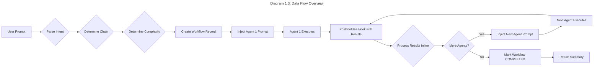
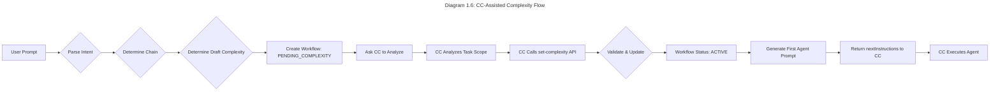
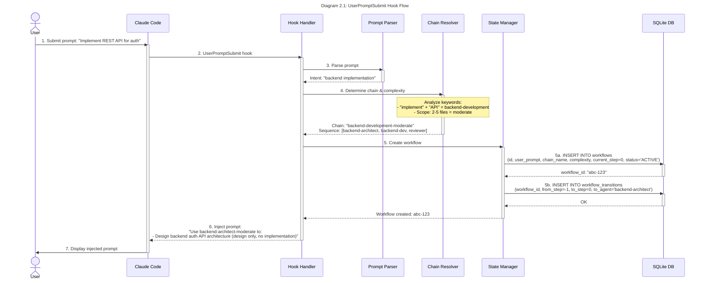
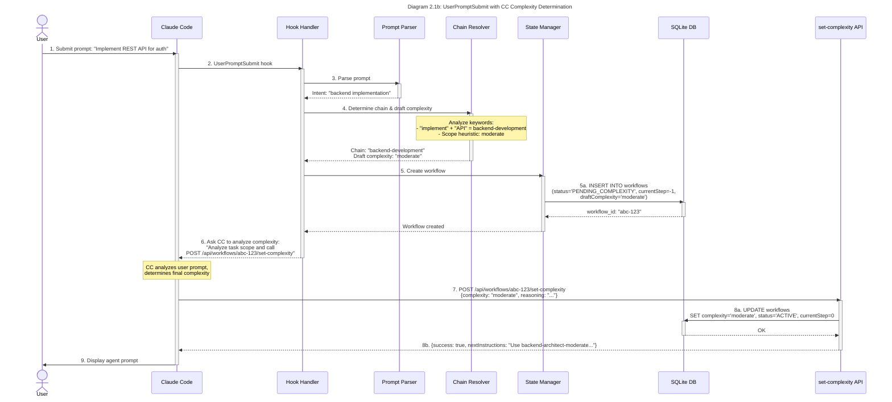
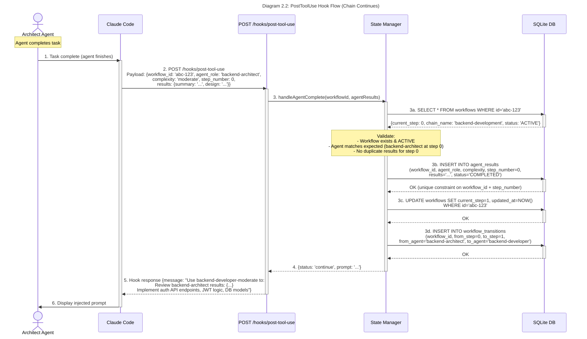
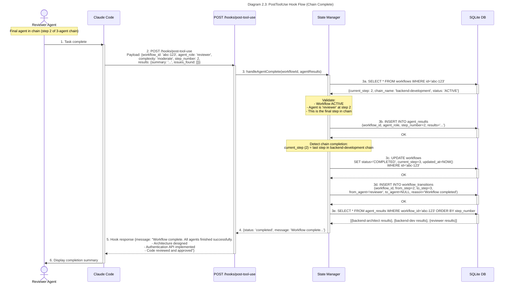
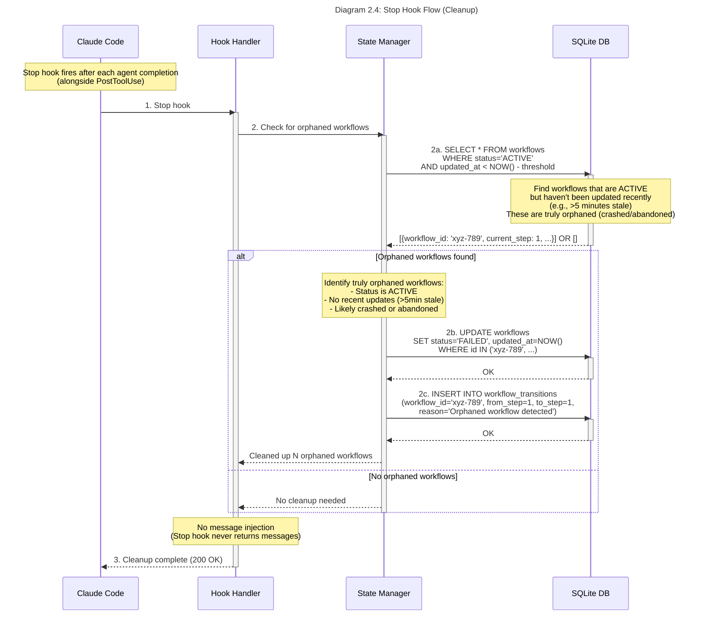
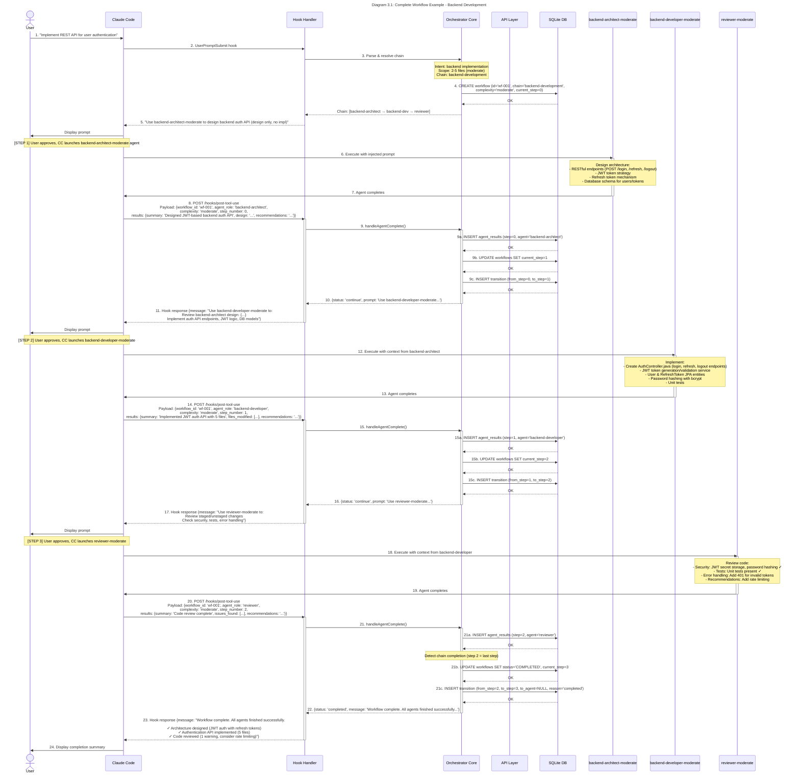
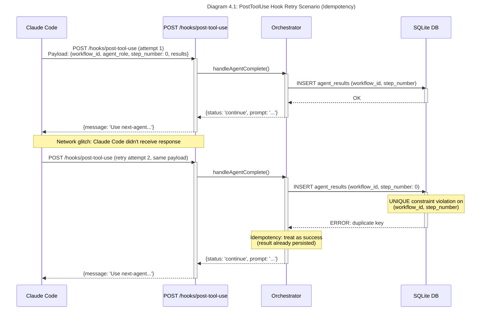
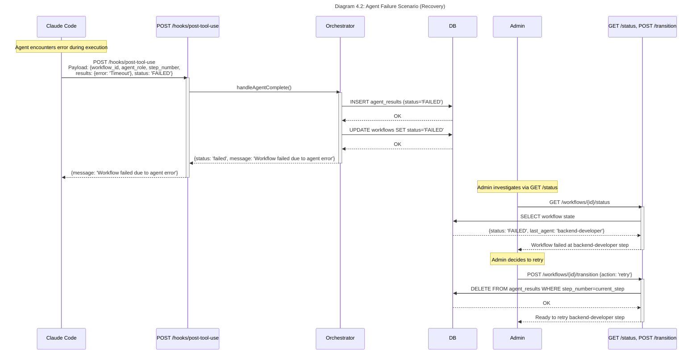

# CCOrch Architecture & Sequence Diagrams

> **Document Concern**: STRUCTURE (diagrams, visual flows)
>
> This document provides comprehensive architectural diagrams and sequence flows for the Claude Code Orchestrator (CCOrch) system. For product requirements, see `PRD.md`. For technical implementation details, see `technical-spec.md`.

**Related Documents**:
- `PRD.md` - Product requirements (WHAT and WHY)
- `technical-spec.md` - Technical implementation details (HOW)
- `architecture.md` - System architecture and sequence diagrams (STRUCTURE)
- `development-plan.md` - Implementation phases and timeline (WHEN)
- `WBS.md` - Granular work breakdown (TASKS)

## Table of Contents
1. [System Architecture](#1-system-architecture)
2. [Hook Flow Sequences](#2-hook-flow-sequences)
3. [Complete Workflow Example](#3-complete-workflow-example)

---

## 1. System Architecture

### 1.1 Component Overview

```mermaid
---
title: "Diagram 1.1: System Component Overview"
---
graph TB
    subgraph "User Environment"
        USER[User Terminal]
        CC[Claude Code CLI]
    end

    subgraph "CCOrch Server"
        HOOK_HANDLER[Hook Handler]
        PARSER[Prompt Parser]
        RESOLVER[Chain Resolver]
        STATE_MGR[State Manager]
        API[API Layer]

        HOOK_HANDLER -->|2a. Parse| PARSER
        PARSER -->|2b. Resolve chain| RESOLVER
        RESOLVER -->|2c. Create workflow| STATE_MGR
        API -->|5a. Validate & save| STATE_MGR
    end

    subgraph "Data Layer"
        DB[(SQLite DB)]
        WORKFLOWS[workflows table]
        RESULTS[agent_results table]
        TRANSITIONS[workflow_transitions table]

        DB -.->|Schema| WORKFLOWS
        DB -.->|Schema| RESULTS
        DB -.->|Schema| TRANSITIONS
    end

    subgraph "Claude Code Agents"
        BEARCH["backend-architect-(complexity)"]
        FEARCH["frontend-architect-(complexity)"]
        BACKEND["backend-developer-(complexity)"]
        FRONTEND["frontend-developer-(complexity)"]
        REVIEWER["reviewer-(complexity)"]
        DEBUGGER["debugger-(complexity)"]
    end

    USER -->|1. Submit prompt| CC
    CC -->|2. UserPromptSubmit hook| HOOK_HANDLER
    HOOK_HANDLER -->|3. Inject agent prompt| CC
    CC -->|4. Execute agent| ARCH
    CC -->|4. Execute agent| BACKEND
    CC -->|4. Execute agent| FRONTEND
    CC -->|4. Execute agent| REVIEWER
    CC -->|4. Execute agent| DEBUGGER
    ARCH -.->|5. PostToolUse hook (with results)| HOOK_HANDLER
    BACKEND -.->|5. PostToolUse hook (with results)| HOOK_HANDLER
    FRONTEND -.->|5. PostToolUse hook (with results)| HOOK_HANDLER
    REVIEWER -.->|5. PostToolUse hook (with results)| HOOK_HANDLER
    DEBUGGER -.->|5. PostToolUse hook (with results)| HOOK_HANDLER
    STATE_MGR <-->|7. Read/Write| DB
```

### 1.2 Architecture Layers

#### Hook Integration Layer
- **Purpose**: Intercepts Claude Code lifecycle events
- **Components**: `UserPromptSubmit`, `SubagentStop`, `Stop` handlers
- **Responsibilities**:
  - Parse incoming hook payloads
  - Generate prompt injections for Claude Code
  - Coordinate with orchestration layer

#### Orchestration Core Layer
- **Purpose**: Business logic for workflow management
- **Components**:
  - **Prompt Parser**: Extracts action type, keywords, and context from user prompts
  - **Chain Resolver**: Maps intent to predefined workflow chains, determines complexity level
  - **State Manager**: Maintains workflow lifecycle, manages transitions, ensures consistency
- **Responsibilities**:
  - Intent analysis and chain selection
  - Complexity determination (simple/moderate/complex)
  - Agent sequencing and task generation
  - Workflow state transitions

#### API Layer
- **Purpose**: External interface for monitoring and administration
- **Public API Endpoints**:
  - `GET /api/workflows/{workflow_id}/status`: Workflow status query (read-only)
  - `POST /api/workflows/{workflow_id}/set-complexity`: CC complexity determination
- **Admin API Endpoints**:
  - `POST /api/workflows/{workflow_id}/transition`: Admin workflow control (API key required)
- **Hook Endpoints** (called by Claude Code):
  - `POST /hooks/user-prompt-submit`: Receives UserPromptSubmit hook, returns agent injection
  - `POST /hooks/post-tool-use`: Receives PostToolUse hook with agent results in payload, returns next agent or completion
  - `POST /hooks/stop`: Receives Stop hook for cleanup
- **Responsibilities**:
  - Request validation (zod schemas)
  - Authentication (X-Hook-Secret for hooks, API key for admin endpoints)
  - Response formatting
- **Note**: Agent results are NOT submitted via separate API endpoint. They are received via PostToolUse hook payload and processed inline.

#### Data Persistence Layer
- **Purpose**: Workflow state storage and audit logging
- **Technology**: SQLite with Prisma ORM
- **Tables**:
  - **workflows**: Main workflow state (id, chain_name, complexity, current_step, status)
  - **agent_results**: Agent execution outputs (workflow_id, agent_role, results JSON, step_number)
  - **workflow_transitions**: Audit log (from_step, to_step, from_agent, to_agent, reason)
- **Guarantees**: ACID transactions, idempotency via unique constraints

### 1.3 Data Flow



### 1.4 Workflow Chains

CCOrch supports 10 predefined workflow chains:

| Chain Name | Agent Sequence | Use Case |
|------------|----------------|----------|
| `backend-development` | backend-architect → backend-developer → reviewer | Full backend feature development |
| `frontend-development` | frontend-architect → frontend-developer → reviewer | Full frontend feature development |
| `debug` | debugger → backend/frontend-developer → reviewer | Bug investigation and fix |
| `review` | reviewer → backend/frontend-developer | Code review with optional fixes |
| `backend-design-only` | backend-architect | Backend architecture design without implementation |
| `frontend-design-only` | frontend-architect | Frontend architecture design without implementation |
| `backend-only` | backend-developer | Backend implementation without design |
| `frontend-only` | frontend-developer | Frontend implementation without design |
| `review-only` | reviewer | Code review without fixes |
| `debug-only` | debugger | Debug investigation without fixes |

**Backend vs Frontend Selection**: For chains with both options (`debug`, `review`), CCOrch uses keyword analysis:
- **Backend keywords**: `java`, `api`, `database`, `controller`, `service`, `repository`, `junit`, `rest`, `endpoint`, `sql`
- **Frontend keywords**: `ui`, `ux`, `component`, `home`, `page`, `typescript`, `web`, `react`, `vue`, `css`, `html`, `button`
- **Default**: backend-developer if ambiguous

### 1.5 Complexity Levels

Each agent in a chain is assigned one of three complexity levels:

| Level | Max Lines | Scope | Use Case |
|-------|-----------|-------|----------|
| **simple** | 8 | Single file/function | Quick fixes, renames, small additions |
| **moderate** | 20 | 2-5 files | Feature implementations, API endpoints |
| **complex** | 50 | Multi-module/system-wide | Architecture design, refactoring, migrations |

**Determination Strategy**:
1. **Keyword analysis**: `quick`, `fix` → simple; `design`, `refactor` → complex
2. **Scope analysis**: Single file → simple; 2-5 files → moderate; System-wide → complex
3. **Default**: moderate if ambiguous

---

### 1.6 CC-Assisted Complexity Determination (Optional Feature)

**Feature Flag**: `ENABLE_CC_COMPLEXITY=true`

When enabled, CCOrch delegates final complexity determination to Claude Code instead of relying solely on keyword-based heuristics:



**Key Points**:
- Draft complexity serves as initial estimate for CC's analysis
- Workflow remains in `PENDING_COMPLEXITY` state until CC responds
- Stop hook cleanup marks workflows >5min old as FAILED (timeout)
- CC receives agent prompt in `nextInstructions` field of API response

---

## 2. Hook Flow Sequences

### 2.1 UserPromptSubmit Hook Flow

**Trigger**: User submits a prompt to Claude Code



**Key Steps**:
1. **Hook emission**: Claude Code emits `UserPromptSubmit` when user submits prompt
2. **Intent parsing**: Extract action type (design, implement, review, debug)
3. **Chain resolution**: Map intent to workflow chain, determine complexity
4. **Workflow creation**: Insert workflow record in DB with status=ACTIVE, current_step=0
5. **Audit logging**: Record transition in workflow_transitions table
6. **Prompt injection**: Return formatted prompt instructing CC to use the first agent (backend-architect-moderate in this example) for the assigned task. When the agent completes, Claude Code will fire PostToolUse hook with results in the payload, triggering the next step in the chain.

**Database State After**:
```sql
-- workflows table
id='abc-123', user_prompt='Implement REST API for auth', chain_name='backend-development',
complexity='moderate', current_step=0, status='ACTIVE'

-- workflow_transitions table
workflow_id='abc-123', from_step=-1, to_step=0, from_agent=NULL, to_agent='backend-architect'
```

---

### 2.1b UserPromptSubmit Hook Flow (with CC Complexity Analysis)

**Trigger**: User submits a prompt to Claude Code (with `ENABLE_CC_COMPLEXITY=true`)



**Key Differences from Standard Flow**:
1. Workflow created with `status=PENDING_COMPLEXITY` and `currentStep=-1`
2. Hook response asks CC to analyze complexity (not immediate agent injection)
3. CC makes API call to submit complexity determination
4. API response contains `nextInstructions` for first agent
5. Adds ~500ms latency but improves accuracy

---

### 2.2 PostToolUse Hook Flow (Chain Continues)

**Trigger**: Agent completes and Claude Code fires PostToolUse hook with results in payload



**Key Steps**:
1. **Agent completion**: Agent finishes task, Claude Code fires PostToolUse hook
2. **Hook request**: Claude Code sends POST request to `/hooks/post-tool-use` with results in payload (workflow_id, agent_role, complexity, step_number, results)
3. **Inline processing**: Hook handler extracts results from payload and calls orchestrator.handleAgentComplete()
4. **Validation**: Verify workflow exists, is ACTIVE, agent matches expected role
5. **Idempotency check**: Unique constraint on `(workflow_id, step_number)` prevents duplicates
6. **Result persistence**: Insert agent_results record with step_number
7. **Workflow advancement**: Increment current_step, update timestamp
8. **Audit logging**: Record transition with from_agent and to_agent
9. **Next agent injection**: Orchestrator returns next agent prompt, hook handler returns it in hook response message field:
   - Use the next agent in the chain (backend-developer-moderate)
   - Review previous agent's results (backend-architect's design)
   - Execute the next task (implement auth API endpoints)
   - Synchronous orchestration - next prompt injected directly in PostToolUse hook response

**Database State After**:
```sql
-- workflows table
current_step=1 (incremented), updated_at=<new_timestamp>

-- agent_results table
workflow_id='abc-123', agent_role='backend-architect', step_number=0, results='...'

-- workflow_transitions table (new row)
workflow_id='abc-123', from_step=0, to_step=1, from_agent='backend-architect', to_agent='backend-developer'
```

---

### 2.3 PostToolUse Hook Flow (Chain Complete)

**Trigger**: Final agent in chain completes, fires PostToolUse hook



**Key Steps**:
1. **Final agent completion**: Last agent finishes, Claude Code fires PostToolUse hook
2. **Hook request**: Claude Code sends POST to `/hooks/post-tool-use` with results in payload
3. **Inline processing**: Hook handler calls orchestrator.handleAgentComplete()
4. **Result persistence**: Insert agent_results record
5. **Chain completion detection**: Check if current_step equals chain length
6. **Workflow finalization**: Update status to COMPLETED, increment current_step
7. **Audit logging**: Record final transition with to_agent=NULL
8. **Summary generation**: Aggregate results from all agents
9. **Completion message**: Orchestrator returns completion status, hook handler returns it in hook response message field:
   - Workflow completion status
   - Summary of each agent's contributions (architecture, implementation, review)
   - No further agent prompt injection (chain complete)
   - Synchronous orchestration complete

**Database State After**:
```sql
-- workflows table
status='COMPLETED', current_step=3 (beyond last agent), updated_at=<timestamp>

-- agent_results table (all steps completed)
step_number=0: backend-architect results
step_number=1: backend-developer results
step_number=2: reviewer results

-- workflow_transitions table (final transition)
from_step=2, to_step=3, from_agent='reviewer', to_agent=NULL, reason='Workflow completed'
```

---

### 2.4 Stop Hook Flow (Cleanup)

**Trigger**: Fires after **each agent completion** (alongside PostToolUse hook)

**Important**: The `Stop` hook does NOT signal session termination or chain completion. It fires after every agent execution as part of the prompt lifecycle. Use `PostToolUse` for chain continuation logic.



**Key Steps**:
1. **Hook emission**: Claude Code emits `Stop` hook after **every agent completion** (not just session end)
2. **Orphan detection**: Query for ACTIVE workflows with stale timestamps (>5 min old)
3. **Status update**: Mark truly orphaned workflows as FAILED (if any found)
4. **Audit logging**: Record cleanup reason in workflow_transitions
5. **No injection**: Stop hook never performs message injection (always returns 200 OK)

**Database State After** (if orphaned workflows found):
```sql
-- workflows table (orphaned workflows marked FAILED)
status='FAILED', updated_at=<timestamp>

-- workflow_transitions table (cleanup audit)
reason='Orphaned workflow detected'
```

**Orphan Detection Strategy**:
- Workflows with status='ACTIVE'
- Last updated_at > 5 minutes ago (configurable threshold)
- No recent agent_results submissions
- **Note**: Most Stop hook invocations will find **zero** orphaned workflows (normal operation)

---

## 3. Complete Workflow Example

### 3.1 End-to-End Sequence: "Implement REST API for User Authentication"

This example demonstrates a complete `backend-development-moderate` workflow with all three agents.



### 3.2 Database State Progression

**After UserPromptSubmit (Step 0)**:
```sql
-- workflows
id='wf-001', user_prompt='Implement REST API for user authentication',
chain_name='backend-development', complexity='moderate', current_step=0, status='ACTIVE'

-- workflow_transitions
from_step=-1, to_step=0, from_agent=NULL, to_agent='backend-architect'
```

**After Backend Architect Completion (Step 1)**:
```sql
-- workflows
current_step=1, updated_at=<timestamp>

-- agent_results
step_number=0, agent_role='backend-architect', results='{"summary":"Designed JWT-based backend auth API",...}'

-- workflow_transitions (new row)
from_step=0, to_step=1, from_agent='backend-architect', to_agent='backend-developer'
```

**After Backend Developer Completion (Step 2)**:
```sql
-- workflows
current_step=2

-- agent_results (new row)
step_number=1, agent_role='backend-developer', results='{"summary":"Implemented JWT auth API",...}'

-- workflow_transitions (new row)
from_step=1, to_step=2, from_agent='backend-developer', to_agent='reviewer'
```

**After Reviewer Completion (Step 3 - COMPLETED)**:
```sql
-- workflows
current_step=3, status='COMPLETED'

-- agent_results (new row)
step_number=2, agent_role='reviewer', results='{"summary":"Code review complete",...}'

-- workflow_transitions (new row)
from_step=2, to_step=3, from_agent='reviewer', to_agent=NULL, reason='Workflow completed'
```

### 3.3 Timing Considerations

| Phase | Component | Time Budget | Notes |
|-------|-----------|-------------|-------|
| Hook processing | Hook Handler → Orchestrator | <500ms | PRD requirement (section 8.1) |
| Chain determination | Prompt Parser + Chain Resolver | <200ms | Keyword analysis, chain mapping |
| DB write | State Manager → SQLite | <100ms | Single transaction with 3 writes |
| Agent execution | Claude Code agent | Variable | Depends on task complexity |
| API submission | Agent → CCOrch API | <200ms | Result validation + persistence |
| Transition logic | State Manager | <1s | PRD requirement (section 8.1) |

**Total overhead per agent transition**: ~800ms (excludes agent execution time)

---

## 4. Error Handling & Edge Cases

### 4.1 Hook Retry Scenario



**Idempotency Guarantee**: Unique constraint on `(workflow_id, step_number)` prevents duplicate agent results. Hook retries return the same response as the original request.

### 4.2 Agent Failure Scenario



---

## 5. References

- **PRD**: `docs/PRD.md` - Complete product requirements
- **Development Plan**: `docs/development-plan.md` - Implementation phases
- **Claude Code Hooks Guide**: https://docs.claude.com/en/docs/claude-code/hooks-guide.md
- **Hook Reference**: https://docs.claude.com/en/docs/claude-code/hooks.md
- **Subagent Reference**: https://docs.claude.com/en/docs/claude-code/sub-agents.md
