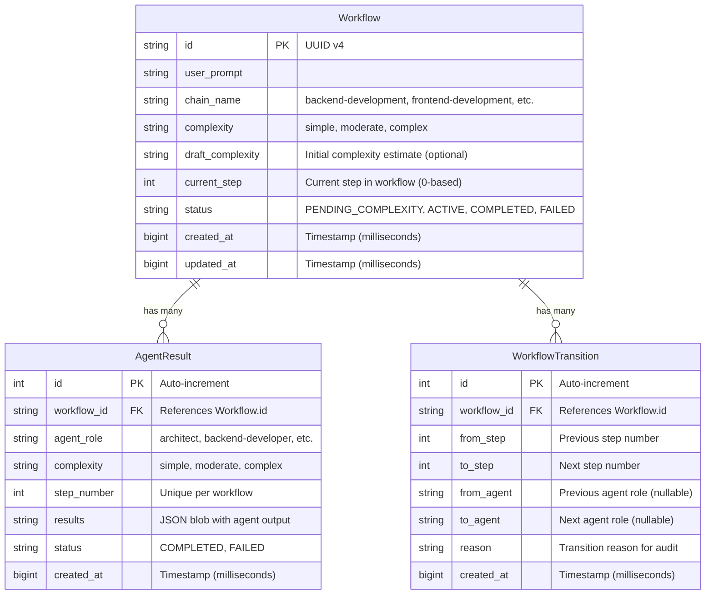

# Database Documentation

This document provides comprehensive guidance for all database operations in the Claude Code Orchestrator (CCOrch) project.

## Table of Contents

1. [Schema Overview](#schema-overview)
2. [Migration Commands](#migration-commands)
3. [Seed Usage](#seed-usage)
4. [Backup and Restore](#backup-and-restore)
5. [Prisma Studio](#prisma-studio)
6. [Repository Interface Contracts](#repository-interface-contracts)

---

## Schema Overview

CCOrch uses SQLite as the primary database with Prisma ORM for type-safe data access. The database consists of three core tables that track workflow orchestration state.

> **Note**: Schema was extended in Phase 1.5 (addendum) to support CC-assisted complexity determination. See migration `20251005041417_add_draft_complexity` for details.

### Entity Relationship Diagram



### Table Details

#### `workflows`

**Purpose**: Main workflow state tracking

| Column | Type | Description |
|--------|------|-------------|
| `id` | TEXT (PK) | UUID v4 identifier |
| `user_prompt` | TEXT | Original user request |
| `chain_name` | TEXT | Workflow chain type (e.g., `backend-development`) |
| `complexity` | TEXT | Agent complexity level (`simple`, `moderate`, `complex`) |
| `draft_complexity` | TEXT | Initial keyword-based complexity estimate (optional, added in Phase 1.5) |
| `current_step` | INTEGER | Current step in workflow (default: 0) |
| `status` | TEXT | Workflow status (`PENDING_COMPLEXITY`, `ACTIVE`, `COMPLETED`, `FAILED`) |
| `created_at` | INTEGER | Creation timestamp (BigInt milliseconds) |
| `updated_at` | INTEGER | Last update timestamp (BigInt milliseconds) |

**Indexes**:
- `idx_workflows_status` on `status`
- `idx_workflows_created` on `created_at`

#### `agent_results`

**Purpose**: Store agent execution outputs

| Column | Type | Description |
|--------|------|-------------|
| `id` | INTEGER (PK) | Auto-increment ID |
| `workflow_id` | TEXT (FK) | References `workflows.id` |
| `agent_role` | TEXT | Agent role name |
| `complexity` | TEXT | Complexity level |
| `step_number` | INTEGER | Step number (unique per workflow) |
| `results` | TEXT | JSON blob with agent output |
| `status` | TEXT | Result status (default: `COMPLETED`) |
| `created_at` | INTEGER | Timestamp (BigInt milliseconds) |

**Unique Constraint**: `(workflow_id, step_number)` - prevents duplicate submissions

**Indexes**:
- `idx_agent_results_workflow` on `workflow_id`

**Cascade Delete**: Deletes when parent workflow is deleted

#### `workflow_transitions`

**Purpose**: Audit log for workflow state changes

| Column | Type | Description |
|--------|------|-------------|
| `id` | INTEGER (PK) | Auto-increment ID |
| `workflow_id` | TEXT (FK) | References `workflows.id` |
| `from_step` | INTEGER | Previous step number |
| `to_step` | INTEGER | Next step number |
| `from_agent` | TEXT | Previous agent role (nullable) |
| `to_agent` | TEXT | Next agent role (nullable) |
| `reason` | TEXT | Transition reason (default: "Agent completed successfully") |
| `created_at` | INTEGER | Timestamp (BigInt milliseconds) |

**Indexes**:
- `idx_transitions_workflow` on `workflow_id`

**Cascade Delete**: Deletes when parent workflow is deleted

---

## Migration Commands

### Development Workflow

#### Create New Migration

When you modify `prisma/schema.prisma`, create a migration:

```bash
pnpm prisma migrate dev --name <migration_name>
```

Example:
```bash
pnpm prisma migrate dev --name add_workflow_metadata
```

This command:
1. Generates SQL migration file in `prisma/migrations/`
2. Applies migration to development database
3. Regenerates Prisma Client
4. Runs seed script (if configured)

#### Check Migration Status

```bash
pnpm prisma migrate status
```

Shows applied and pending migrations.

#### Applied Migrations

Current migration history:

1. **Initial schema** - `20241004_XXXXXX_init` (Phase 1)
   - Created `workflows`, `agent_results`, `workflow_transitions` tables
   - Established foreign key relationships and indexes

2. **CC-assisted complexity** - `20251005041417_add_draft_complexity` (Phase 1.5)
   - Added `draft_complexity` column to `workflows` table
   - Added `PENDING_COMPLEXITY` workflow status support
   - Enables Claude Code-assisted complexity determination feature

#### Reset Database (Destructive)

**⚠️ WARNING**: Deletes all data and reapplies migrations from scratch.

```bash
pnpm prisma migrate reset --force
```

Use cases:
- Development database corruption
- Testing migration scripts
- Resetting to clean state with seed data

### Production Workflow

#### Deploy Migrations

For production/staging environments:

```bash
pnpm prisma migrate deploy
```

This command:
- Applies pending migrations only
- Does **not** drop database
- Does **not** run seed script
- Safe for production use

#### Resolve Migration Conflicts

If migrations are out of sync:

```bash
pnpm prisma migrate resolve --applied <migration_name>
```

Marks a migration as applied without running it.

---

## Seed Usage

### Running Seed Script

Populate database with sample data:

```bash
pnpm prisma db seed
```

This runs `prisma/seed.ts`, which creates:
- 1 workflow (`backend-development` chain)
- 3 agent results (architect → backend-developer → reviewer)
- 2 workflow transitions

### Reset with Seed

Reset database and automatically run seed:

```bash
pnpm prisma migrate reset --force
```

⚠️ **Destructive operation** - deletes all data.

### Customizing Seed Data

Edit `prisma/seed.ts` to modify sample data. The seed script uses repository classes:

```typescript
import { getPrismaClient } from '../src/config/database';
import { WorkflowRepository } from '../src/models/workflow-repository';
import { AgentResultRepository } from '../src/models/agent-result-repository';
import { TransitionRepository } from '../src/models/transition-repository';
```

---

## Backup and Restore

### SQLite Backup

CCOrch uses SQLite for local development. Back up the database file:

#### Option 1: File Copy (Simple)

```bash
cp prisma/dev.db prisma/dev.db.backup
```

#### Option 2: SQLite Backup Command (Safe for Active Connections)

```bash
sqlite3 prisma/dev.db ".backup prisma/dev.db.backup"
```

This method is safe even if the database is in use.

#### Option 3: SQL Dump

```bash
sqlite3 prisma/dev.db .dump > backup.sql
```

### Restore from Backup

#### From File Copy

```bash
cp prisma/dev.db.backup prisma/dev.db
```

#### From SQL Dump

```bash
sqlite3 prisma/dev.db < backup.sql
```

### Scheduled Backups (Production)

For production SQLite deployments, consider:

```bash
# Cron job (daily at 2 AM)
0 2 * * * sqlite3 /path/to/prod.db ".backup /backups/prod-$(date +\%Y\%m\%d).db"
```

**Note**: For production at scale, consider migrating to PostgreSQL (repository abstraction supports this).

---

## Prisma Studio

### Launch Studio

Visual database browser:

```bash
pnpm prisma studio
```

Opens at `http://localhost:5555` by default.

### Features

- **Browse Data**: View all tables and records
- **Edit Records**: Modify data directly in GUI
- **Filter & Sort**: Query data visually
- **Relationships**: Navigate foreign key relationships

### Use Cases

- Inspect seed data after `pnpm prisma migrate reset`
- Debug workflow state during development
- Manually create test scenarios
- Verify data integrity after migrations

---

## Repository Interface Contracts

CCOrch uses the **Repository Pattern** to abstract data access. This enables future migration from SQLite to Redis or PostgreSQL without changing application code.

### Interface Definitions

All repository interfaces are defined in `src/types/repositories.ts`.

#### `IWorkflowRepository`

```typescript
interface IWorkflowRepository {
  createWorkflow(data: WorkflowCreateInput): Promise<Workflow>;
  findById(id: string, options?: WorkflowFindByIdOptions): Promise<WorkflowWithRelations | null>;
  findByStatus(status: WorkflowStatus): Promise<Workflow[]>;
  findActive(): Promise<Workflow[]>;
  updateStatus(id: string, status: WorkflowStatus, currentStep?: number): Promise<Workflow>;
  deleteWorkflow(id: string): Promise<boolean>;
}
```

**Implementation**: `src/models/workflow-repository.ts`

**Key Features**:
- UUID generation for workflow IDs
- Automatic timestamp management (`createdAt`, `updatedAt`)
- Supports eager loading of relations (agent results, transitions)

#### `IAgentResultRepository`

```typescript
interface IAgentResultRepository {
  createResult(data: AgentResultCreateInput): Promise<AgentResult>;
  findByWorkflowId(workflowId: string): Promise<AgentResult[]>;
  findByWorkflowIdAndStep(workflowId: string, stepNumber: number): Promise<AgentResult | null>;
}
```

**Implementation**: `src/models/agent-result-repository.ts`

**Key Features**:
- **Idempotency enforcement**: Throws error on duplicate `(workflowId, stepNumber)`
- JSON results field for flexible agent output
- Auto-incrementing ID

#### `ITransitionRepository`

```typescript
interface ITransitionRepository {
  createTransition(data: WorkflowTransitionCreateInput): Promise<WorkflowTransition>;
  findByWorkflowId(workflowId: string): Promise<WorkflowTransition[]>;
  findLatest(workflowId: string): Promise<WorkflowTransition | null>;
}
```

**Implementation**: `src/models/transition-repository.ts`

**Key Features**:
- Audit log for all workflow state changes
- Records forward transitions (step 0 → 1) and backward transitions (retry scenarios)
- Nullable `fromAgent`/`toAgent` for workflow start/end states

### Migration Path to Redis

To migrate from SQLite to Redis:

1. **Create new implementations** of `IWorkflowRepository`, `IAgentResultRepository`, `ITransitionRepository` using Redis client
2. **Update dependency injection** in application setup to use Redis repositories
3. **No changes required** to orchestration logic, hooks, or API endpoints

Example:

```typescript
// Before (SQLite)
const prisma = getPrismaClient();
const workflowRepo = new WorkflowRepository(prisma);

// After (Redis)
const redis = getRedisClient();
const workflowRepo = new RedisWorkflowRepository(redis);
```

### Testing Strategy

All repositories have comprehensive unit tests with **mocked Prisma clients**:

- `tests/unit/repositories/workflow-repository.test.ts` (20 tests)
- `tests/unit/repositories/agent-result-repository.test.ts` (17 tests)
- `tests/unit/repositories/transition-repository.test.ts` (18 tests)

This ensures repository behavior is validated independently of database implementation.

---

## Quick Reference

### Common Commands

```bash
# Generate Prisma Client after schema changes
pnpm prisma generate

# Create and apply migration
pnpm prisma migrate dev --name <name>

# Reset database + seed
pnpm prisma migrate reset --force

# Run seed only
pnpm prisma db seed

# Open Prisma Studio
pnpm prisma studio

# Backup database
sqlite3 prisma/dev.db ".backup prisma/backup.db"

# Check migration status
pnpm prisma migrate status
```

### Environment Variables

```env
# .env file
DATABASE_URL="file:./dev.db"
```

For production:

```env
DATABASE_URL="file:/var/data/ccorch/prod.db"
```

### Getting Started (New Developer)

1. Clone repository
2. Install dependencies: `pnpm install`
3. Generate Prisma Client: `pnpm prisma generate`
4. Apply migrations: `pnpm prisma migrate dev`
5. Seed database: `pnpm prisma db seed`
6. Verify data: `pnpm prisma studio`

---

## Troubleshooting

### Migration Conflicts

**Problem**: `Error: P3006: Migration <name> failed to apply`

**Solution**:
```bash
pnpm prisma migrate resolve --applied <migration_name>
pnpm prisma migrate deploy
```

### Database Locked

**Problem**: `Error: database is locked`

**Solution**:
1. Close all Prisma Studio instances
2. Stop development server
3. Retry operation

### Prisma Client Out of Sync

**Problem**: `Error: Prisma Client is outdated`

**Solution**:
```bash
pnpm prisma generate
```

### Seed Script Fails

**Problem**: Seed script throws constraint errors

**Solution**:
```bash
# Reset database completely
pnpm prisma migrate reset --force
```

---

## Additional Resources

- [Prisma Documentation](https://www.prisma.io/docs)
- [Prisma Schema Reference](https://www.prisma.io/docs/reference/api-reference/prisma-schema-reference)
- [SQLite Documentation](https://www.sqlite.org/docs.html)
- CCOrch Project: `docs/technical-spec.md` (database schema details)
