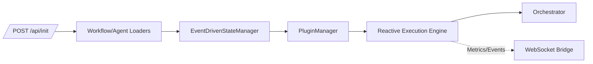
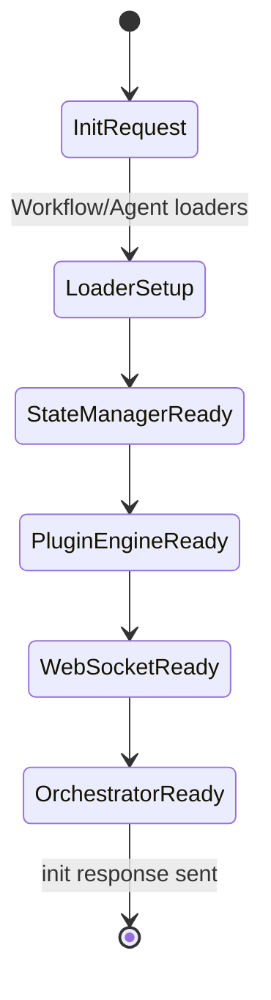
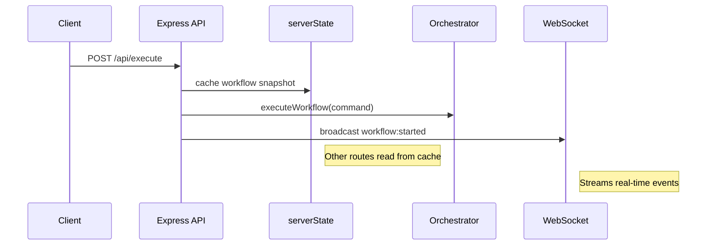
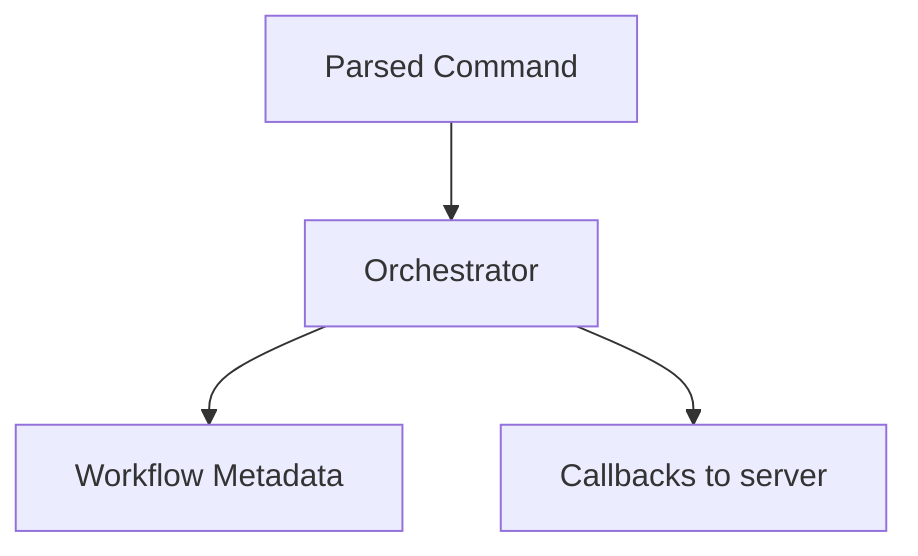
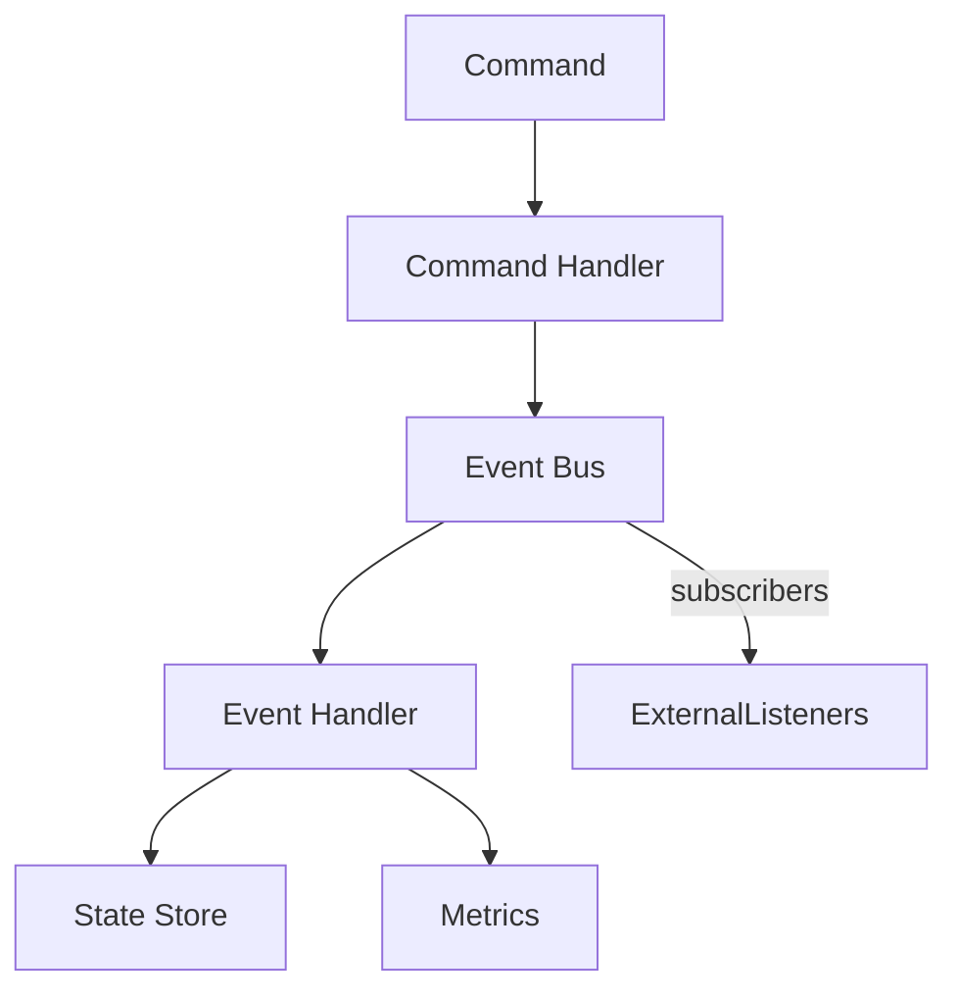
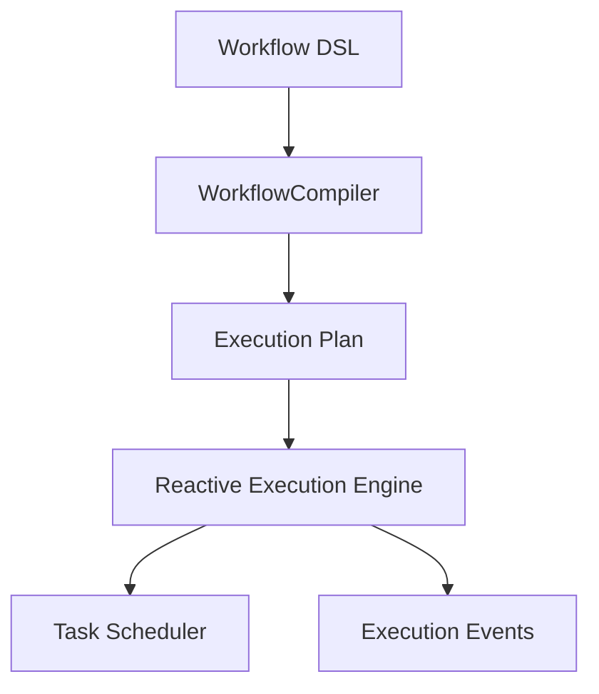
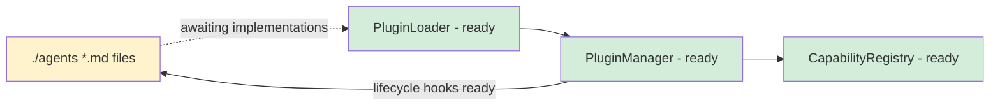
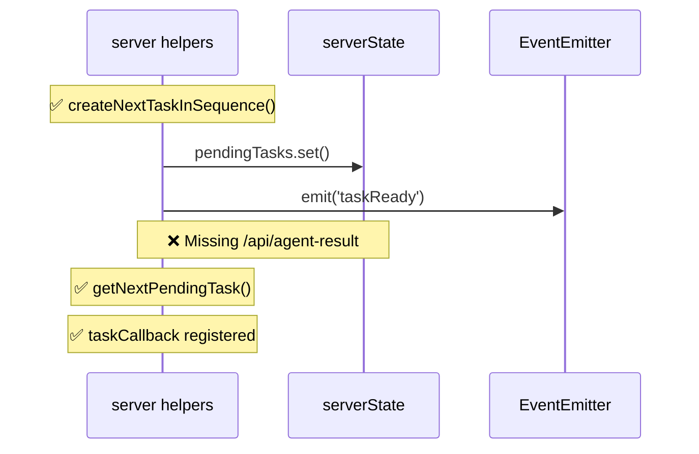
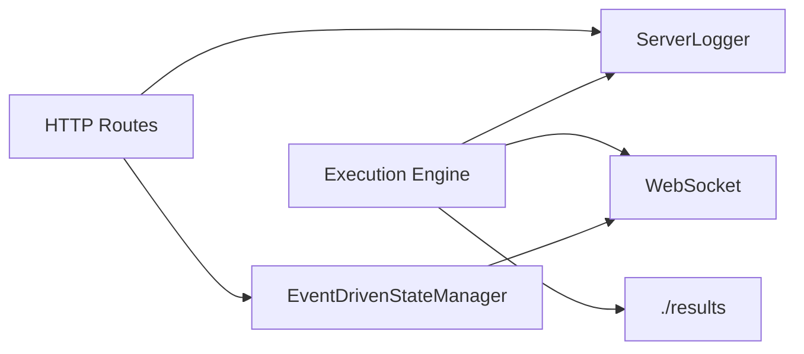

# Orchestrator V2 – Maintainers Deep Dive

This maintainer-focused guide dives into the orchestrator internals once you already understand the high-level map. Each section highlights a small slice of code, explains what to look for, and points you to the file for deeper exploration. Keep the server running in one terminal (`npm run dev`) so you can try the experiments inline.

## Implementation Status

This guide reflects the **actual implementation** as of 2025-09-30. Throughout, you'll see:

- ✅ **Fully Implemented** – Production-ready code with tests
- 🚧 **Partially Implemented** – Core functionality exists, missing integration
- 📋 **Planned** – Designed in code comments but not implemented
- ❌ **Not Implemented** – Referenced in earlier docs but doesn't exist

**Critical Gap**: The HTTP API has only 5 endpoints implemented (lines 403, 640, 687, 806, 822 in server/index.ts). Lines 865-876 contain comments listing 10+ additional endpoints that are **not implemented**. This breaks the documented task progression loop.

## 1. Lifecycle Bootstrapping

The `/api/init` route in `server/index.ts` is where every dependency comes alive. Trimmed to the essentials:

```ts
// server/index.ts (simplified)
workflowLoader = new WorkflowLoader();
await workflowLoader.initialize();            // (1) load workflow templates

stateManager = new EventDrivenStateManager();
await stateManager.initialize();              // (2) register CQRS handlers

pluginManager = new PluginManager({ pluginsDir: './agents' });
await pluginManager.initialize();             // (3) discover agent plugins

executionEngine = new ReactiveExecutionEngine({
  stateManager,
  pluginManager,
  workflowCompiler: new WorkflowCompiler(),
  config: { maxConcurrentTasks: 10, defaultTimeout: 60000 }
});
await executionEngine.initialize();           // (4) wire scheduler + monitors

orchestratorInstance = new Orchestrator({ todoWriteCallback, taskCallback });
await orchestratorInstance.initialize({});     // (5) store callbacks & config
```

What to notice:
- **(1)** `WorkflowLoader` seeds built-in agent sequences before any request arrives.
- **(2)** `EventDrivenStateManager.initialize()` calls `registerDefaultHandlers()` (`core/state/event-driven-state-manager.ts:144`), setting up command/query/event wiring and snapshot timers.
- **(3)** `PluginManager.initialize()` (`core/plugins/plugin-manager.ts:49`) auto-discovers manifests under `./agents` so capabilities are ready for task execution.
- **(4)** `ReactiveExecutionEngine.initialize()` (`core/execution/reactive-execution-engine.ts:998`) spins up the scheduler, retry/circuit breakers, checkpointing, recovery, debugger, and monitor modules.
- **(5)** `Orchestrator.initialize()` stores the callbacks used later when the server hands off todos and task results.

If you introduce another subsystem (for example, a metrics exporter), you should slot it into this block so the orchestrator, execution engine, and HTTP layer stay in sync.



> **Experiment:** Drop a `serverLogger.logWithContext` call right after each initialization block inside `/api/init`, restart the server, and rerun the curl command from the high-level guide. You’ll see the boot order reflected in the logs.

## 2. Request Handling Flow

### Currently Implemented Endpoints (✅)



**Implemented Routes** (`server/index.ts`):

| Route | Status | Purpose | Line | Key Implementation |
|-------|--------|---------|------|-------------------|
| `POST /api/init` | ✅ | Bootstrap orchestrator | 403 | Initializes all subsystems (loaders, state manager, plugins, execution engine, WebSocket) |
| `POST /api/parse-command` | ✅ | Parse natural language | 640 | `commandParser.parseCommand()`, returns workflow type suggestions |
| `POST /api/execute` | ✅ | Start workflow | 687 | Creates workflow, scores complexity, broadcasts `workflow:started` |
| `GET /api/todos/:workflowId` | ✅ | Retrieve todo list | 806 | Returns `serverState.pendingTodos` for given workflow |
| `GET /api/health` | ✅ | Health check | 822 | Returns active workflows, pending tasks, WebSocket status |

**Planned But Not Yet Implemented (📋):**

The following endpoints are **referenced in code comments** (server/index.ts:865-876) but **not implemented**:
- ~~`GET /api/next-todo/:workflowId`~~ – fetch next pending todo
- ~~`GET /api/next-task/:workflowId`~~ – fetch next pending task for agent execution
- ~~`POST /api/agent-result`~~ – submit agent execution results
- ~~`GET /api/status/:workflowId`~~ – get detailed workflow status
- ~~`GET /api/workflows`~~ – list all workflows
- ~~`GET /api/debug/workflows`~~ – debug view of all workflows
- ~~`GET /api/debug/workflow/:id`~~ – debug view of single workflow
- ~~`GET /api/debug/task/:taskId`~~ – debug view of single task
- ~~`POST /api/recover-workflow/:workflowId`~~ – attempt workflow recovery
- ~~`POST /api/reset-task/:taskId`~~ – reset stuck task

### Implementation Details

- **Parsing commands** (✅ Implemented): `CommandParser.parseCommand()` (core/command-parser.ts) maps natural-language input to known workflow types. Returns `{ workflowType, taskDescription, complexity }`. The `/api/parse-command` endpoint wraps this with Zod validation.

- **Execution kickoff** (✅ Implemented): `/api/execute` performs these steps:

```ts
// server/index.ts:708-749 (simplified)
const workflowId = `wf_${Date.now()}_${Math.random().toString(36).slice(2)}`;

// (1) Analyze complexity
const complexityAnalysis = complexityDetector.analyzeComplexity(taskDescription);
const detectedComplexity = complexityAnalysis.level;

// (2) Cache workflow state for quick HTTP access
serverState.activeWorkflows.set(workflowId, {
  id: workflowId,
  workflowType,
  taskDescription,
  status: 'starting',
  startTime: new Date().toISOString(),
  complexity: detectedComplexity,
  projectDirectory: projectDirectory || process.cwd()
});

// (3) Hand off to orchestrator (stores in internal map)
const executionPromise = orchestratorInstance.executeWorkflow({
  workflowType,
  taskDescription,
  projectDirectory,
  complexity: detectedComplexity
});

// (4) Broadcast to WebSocket subscribers
broadcastWorkflowEvent('started', workflowId, {
  workflowType,
  taskDescription,
  complexity: detectedComplexity
});
```

`executionPromise` resolves once the orchestrator records the workflow. **Note**: The full task execution loop (agent handoff, result collection) is not yet connected.

- **State management** (✅ Implemented): `serverState` (server/index.ts:158-165) provides in-memory cache:
  - `activeWorkflows` – Map of workflow IDs to workflow state snapshots
  - `pendingTodos` – Map of workflow IDs to todo arrays
  - `pendingTasks` – Map of task IDs to pending task metadata
  - `taskTimeouts` – Timeout handles for task expiry
  - `taskNotifier` – EventEmitter for task ready events
  - `currentWorkflowId` – Pointer to the active workflow

This cache backs fast HTTP responses, while `EventDrivenStateManager` provides event-sourced persistence.

> **Experiment:** Trigger `/api/execute`, then call `/api/health` to see `activeWorkflows` count increment.

**Code References**
- `server/index.ts:403` – `/api/init` implementation
- `server/index.ts:640` – `/api/parse-command` implementation
- `server/index.ts:687` – `/api/execute` handler entry
- `server/index.ts:697-706` – Complexity detection
- `server/index.ts:713-726` – Workflow state stored in `serverState.activeWorkflows`
- `server/index.ts:739` – `orchestratorInstance.executeWorkflow()` call
- `server/index.ts:744-749` – `broadcastWorkflowEvent('started', …)` broadcast
- `server/index.ts:806` – `/api/todos/:workflowId` implementation
- `server/index.ts:822` – `/api/health` implementation
- `server/index.ts:865-876` – Comment listing planned but unimplemented endpoints

## 3. Orchestrator Responsibilities
`core/orchestrator.ts` is intentionally lightweight right now:

- `initialize()` merges config, stores callbacks, and flips an `initialized` flag so `/api/health` can verify readiness.
- `parseCommand()` and `analyzeComplexity()` proxy to shared utilities so they can be reused outside HTTP.
- `executeWorkflow()` seeds metadata and returns an ID:

```ts
// core/orchestrator.ts
async executeWorkflow(command: ParsedCommand): Promise<WorkflowId> {
  const workflowId = `workflow-${Date.now()}` as WorkflowId;
  const workflowData: WorkflowStateData = {
    id: workflowId,
    type: command.workflowType as any,
    status: 'running',
    tasks: [],
    metadata: {
      createdAt: new Date().toISOString(),
      complexity: command.complexity,
      description: command.taskDescription
    }
  };
  this.workflows.set(workflowId, workflowData);
  return workflowId;
}
```

Think of this class as a thin coordinator. Real scheduling happens in the execution engine and HTTP helpers, so future enhancements will fan out from here.

**Code references**
- `core/orchestrator.ts:18` – Constructor storing config/defaults.
- `core/orchestrator.ts:26` – `.initialize()` merge logic.
- `core/orchestrator.ts:37` – `.parseCommand()` delegation.
- `core/orchestrator.ts:42` – `.analyzeComplexity()` delegation.
- `core/orchestrator.ts:46` – `.executeWorkflow()` workflow map update.

The takeaway: the HTTP layer currently orchestrates most side effects while the `Orchestrator` holds canonical metadata and utility helpers.

## 4. Event-Driven State Manager
Open `core/state/event-driven-state-manager.ts` and skim three regions:
1. **Command handlers** – classes like `CreateWorkflowHandler` emit domain events. Public helpers (`createWorkflow`, `updateWorkflowStatus`, `updateTask`, etc.) all funnel into `executeCommand`, ensuring writes are event-sourced.
2. **Event handlers** – `handleWorkflowCreated`, `handleTaskStatusUpdated`, and friends mutate `OrchestratorState` (maps, queues, metrics) and push debounced `StateChangeEvent`s so `updateMetrics()` runs without thrash.
3. **Query handlers** – `GetWorkflow`, `GetTask`, `GetMetrics`, `GetWorkflowsByStatus`, etc. read from cached projections to power debug APIs and dashboards.

```ts
// core/state/event-driven-state-manager.ts
private registerCommandHandlers(): void {
  this.registerCommandHandler('CreateWorkflow', new CreateWorkflowHandler(this));
  this.registerCommandHandler('UpdateTaskStatus', new UpdateTaskStatusHandler(this));
  // ...
}

private handleTaskStatusUpdated(event: StateEvent): void {
  const { taskId, status, output, error } = event.payload;
  const task = this.findTask(taskId);
  if (!task) return;

  task.status = status;
  task.output = output;
  task.error = error;
  task.completedAt = new Date();

  this.changeSubject.next({
    type: 'task',
    operation: 'update',
    entityId: taskId,
    metadata: event.metadata
  });
}
```

| Command | Handler class | Emits | Notes |
|---------|---------------|-------|-------|
| `CreateWorkflow` | `CreateWorkflowHandler` | `WorkflowCreated` | Generates IDs (when absent) and default metadata |
| `UpdateWorkflowStatus` | `UpdateWorkflowStatusHandler` | `WorkflowStatusUpdated` | Moves workflow between active/completed sets |
| `CreateTask` | `CreateTaskHandler` | `TaskCreated` | Enqueues task in priority queue |
| `UpdateTaskStatus` | `UpdateTaskStatusHandler` | `TaskStatusUpdated` | Updates output/error, metrics |
| `AssignAgent` | `AssignAgentHandler` | `AgentAssigned` | Tracks agent-task mapping |
| `UpdateAgentStatus` | `UpdateAgentStatusHandler` | `AgentStatusUpdated` | Maintains agent utilisation |
| `CompleteWorkflow` / `FailWorkflow` / `CancelWorkflow` | respective handlers | `WorkflowStatusUpdated` | Terminal transitions |
| `UPDATE_EXECUTION_STATE` | `UpdateExecutionStateHandler` | `ExecutionStateUpdated` | Syncs reactive engine metadata |

> **Experiment:** Call `stateManager.createWorkflow(...)` from a Node REPL and subscribe via `stateManager.on('WorkflowCreated', evt => console.log(evt.payload))` to observe event propagation.



**Code references**
- `core/state/event-driven-state-manager.ts:120` – State initialisation.
- `core/state/event-driven-state-manager.ts:144` – `registerDefaultHandlers()` linking commands/queries/events.
- `core/state/event-driven-state-manager.ts:151` – Command handler registry.
- `core/state/event-driven-state-manager.ts:174` – Event subscriptions wiring.
- `core/state/event-driven-state-manager.ts:213` – `executeCommand` logging and dispatch.
- `core/state/event-driven-state-manager.ts:772` – `CreateWorkflowHandler` implementation (and neighbouring handlers).

## 5. Workflow Compilation & Execution

- **Compiler pipeline** – `WorkflowCompiler.compile()` (core/workflow/compiler.ts) performs:
  1. DSL validation via `validateWorkflowDSL` (Zod schemas).
  2. AST generation (`generateAST`) with nodes, edges, dependencies, variables.
  3. Optimisation (`optimize`) to apply heuristics such as parallelisation and dependency pruning.
  4. Executable construction (`createExecutable`) producing stage plans (`TaskStage`, `ParallelStage`, `ConditionalStage`, etc.) plus runtime config.
- **Reactive engine** – `ReactiveExecutionEngine.executeWorkflow` (core/execution/reactive-execution-engine.ts:670+) drives the run:
  - `from(plan.stages).pipe(concatMap(...))` enforces stage order.
  - `mergeMap(task => executeTask(task), stage.parallelism ?? 1)` manages bounded concurrency.
  - `tap`, `retryWhen`, `finalize` integrate metrics, retries, and teardown.
  - Derived observables (`events$`, `metrics$`, `context$`) power monitoring and WebSocket streaming.
- **Task executor** – Built inside `createTaskExecutor()`: resolves plugins, applies timeouts, retries (`RetryManager`), circuit breakers (`CircuitBreakerManager`), optional checkpointing (`CheckpointManager`), recovery (`RecoveryManager`), and emits results back through the state manager.
- **Configurables** – `ReactiveExecutionEngineOptions` let you tune concurrency, timeout, checkpointing, recovery, monitoring, debugging. `/api/init` passes these so adjust there for production.

> **Experiment:** Run `npm test -- tests/execution/reactive-execution-engine.test.ts` and watch the order of emitted events change when you tweak the `parallelism` value in the test helpers.

**Code references**
- `core/workflow/compiler.ts:63` – `compile()` entry point.
- `core/workflow/compiler.ts:108` – `generateAST` implementation.
- `core/workflow/compiler.ts:182` – Optimisation pipeline.
- `core/workflow/compiler.ts:214` – `createExecutable` construction.
- `core/execution/reactive-execution-engine.ts:605` – `executeWorkflow()` public API.
- `core/execution/reactive-execution-engine.ts:700` – `executeWorkflowStages()` scheduling logic.
- `core/execution/reactive-execution-engine.ts:740` – Task scheduling loop and checkpoint setup.

## 6. Plugin Discovery

### Current Implementation Status

**✅ Plugin Infrastructure**: The plugin management system is fully implemented with loader, manager, registry, and lifecycle support.

**📋 Agent Implementations**: Agents themselves are currently Markdown specification files, not executable code modules.



### What Exists Today

**Plugin System** (✅ Fully Implemented):
- `PluginManager` (core/plugins/plugin-manager.ts) – Coordinates plugin lifecycle, discovery, loading, unloading
- `PluginLoader` (core/plugins/plugin-loader.ts) – Dynamically imports ESM modules
- `CapabilityRegistry` (core/plugins/capability-registry.ts) – Fast lookups by capability ID, agent name, complexity tier
- Lifecycle events: `plugin-loaded`, `plugin-unloaded`, `initialized`
- Metadata tracking: load time, status (LOADING/LOADED/FAILED/UNLOADING), error messages

**Agent Definitions** (🚧 Specifications Only):
The `./agents` directory contains **18 Markdown files** describing agent behaviors:
- `backend-architect-{simple,moderate,complex}.md`
- `java-backend-developer-{simple,moderate,complex}.md`
- `nextjs-react-developer-{simple,moderate,complex}.md`
- `code-reviewer-{simple,moderate,complex}.md`
- `e2e-test-architect-{simple,moderate,complex}.md`
- `issue-detective-{simple,moderate,complex}.md`

These are **specification documents** (frontmatter + description), not executable TypeScript/JavaScript code.

**Example agent spec** (agents/backend-architect-simple.md):
```md
---
name: backend-architect-simple
description: Design direct solutions that work
model: sonnet
---

# DESIGN ONLY - NO IMPLEMENTATION

Think: Direct path to working solution...
```

### How the Plugin System Works (When Agents Are Implemented)

```ts
// core/plugins/plugin-manager.ts:66-133 (loadPlugin flow)
async loadPlugin(pluginPath: string, manifest?: PluginManifest) {
  const pluginId = manifest?.id || path.basename(pluginPath);

  // (1) Load plugin module (expects ESM with manifest export)
  const result = await this.loader.loadPlugin(pluginId, pluginPath);

  // (2) Initialize plugin with config
  await plugin.initialize(this.config);

  // (3) Register plugin and capabilities
  this.plugins.set(pluginId, plugin);
  this.registerPluginCapabilities(pluginId, plugin);

  // (4) Track metadata
  this.metadata.set(pluginId, {
    loadedAt: new Date(),
    status: PluginStatus.LOADED,
    path: pluginPath
  });

  this.emit('plugin-loaded', { id: pluginId, plugin });
}
```

### Expected Plugin Structure (When Implementing)

Each agent plugin should export:

```ts
// agents/research-assistant/manifest.ts
export const manifest: PluginManifest = {
  id: 'research-assistant',
  version: '1.0.0',
  capabilities: [
    {
      id: 'knowledge-search',
      complexity: ['simple', 'moderate']
    }
  ],
  entry: './index.ts'
};

// agents/research-assistant/index.ts
export class ResearchAssistantPlugin extends BasePlugin {
  async initialize(config: PluginConfig): Promise<void> {
    // Setup logic
  }

  async execute(input: any): Promise<AgentResult> {
    // Agent logic here
    return { success: true, output: '...' };
  }

  async destroy(): Promise<void> {
    // Cleanup
  }
}
```

### Initialization Flow

During `/api/init` (server/index.ts:438-446):
```ts
pluginManager = new PluginManager({
  pluginsDir: './agents',
  enableAutoDiscovery: true,
  requireManifest: false,  // Lenient for development
  maxConcurrentLoads: 5,
  enableCaching: true
});
await pluginManager.initialize();  // Scans ./agents for plugins
```

Currently, `initialize()` finds no executable plugins because only Markdown files exist. The infrastructure is ready—implementations are pending.

**Code References**
- `core/plugins/plugin-manager.ts:32-47` – Constructor, loader/registry setup
- `core/plugins/plugin-manager.ts:49-64` – `initialize()` with auto-discovery
- `core/plugins/plugin-manager.ts:66-134` – `loadPlugin()` implementation
- `core/plugins/plugin-manager.ts:136-172` – `unloadPlugin()` teardown
- `core/plugins/plugin-loader.ts` – Dynamic ESM import with caching
- `core/plugins/capability-registry.ts` – Capability indexing and lookup
- `agents/` – 18 Markdown specification files (not executable code)

## 7. Task Progression Loop

### Current Implementation Status

**🚧 Partially Implemented**: The helper functions and state management exist, but the complete loop is not yet connected due to missing API endpoints.

### What Exists (Infrastructure Ready)



### Helper Functions (All ✅ Implemented)

**1. `getNextPendingTask(workflowId)`** (server/index.ts:228-244)
```ts
async function getNextPendingTask(workflowId: string) {
  for (const [taskId, task] of serverState.pendingTasks) {
    if (task.workflowId === workflowId &&
        (task.status === 'pending' || task.status === 'awaiting_claude_execution')) {
      return { taskId, params: task.params, timestamp: task.timestamp };
    }
  }
  return null;
}
```
Scans `serverState.pendingTasks` to find the next task awaiting execution.

**2. `createNextTaskInSequence(workflowId, workflow, completedAgentType)`** (server/index.ts:246-347)
```ts
async function createNextTaskInSequence(
  workflowId: string,
  workflow: WorkflowState,
  completedAgentType: AgentType
) {
  // (1) Check if next task already exists
  const existingPendingTask = await getNextPendingTask(workflowId);
  if (existingPendingTask) return;

  // (2) Load workflow definition (e.g., 'bug-fix', 'feature-development')
  const workflowDefinition = await workflowLoader.loadWorkflow(workflow.workflowType);
  const sequence = workflowDefinition.agents.sequence;

  // (3) Find next agent in sequence
  const currentAgentIndex = sequence.findIndex(agent => agent.name === completedAgentType);
  const nextAgentIndex = currentAgentIndex + 1;

  if (nextAgentIndex >= sequence.length) {
    // Workflow complete
    workflow.status = 'completed';
    workflow.endTime = new Date().toISOString();
    broadcastWorkflowEvent('completed', workflowId, {...});
    return;
  }

  // (4) Create and register next task
  const nextAgent = sequence[nextAgentIndex];
  const taskId = `task_${Date.now()}_${Math.random().toString(36).slice(2)}`;

  serverState.pendingTasks.set(taskId, {
    workflowId,
    params: { subagent_type: nextAgent.name, description: `...`, prompt: ... },
    timestamp: new Date().toISOString(),
    status: 'awaiting_claude_execution',
    promise: null,
    timeoutId: null
  });

  // (5) Emit taskReady event for listeners
  serverState.taskNotifier.emit('taskReady', { taskId, workflowId, agentType: nextAgent.name });

  // (6) Set timeout for task expiry
  const timeoutObj = setTimeout(() => { /* mark as timeout */ }, AGENT_EXECUTION_TIMEOUT);
  serverState.taskTimeouts.set(taskId, timeoutObj);
}
```
This function orchestrates task handoff but **cannot complete the loop** because no endpoint exists to receive agent results.

**3. `taskCallback`** (server/index.ts:549-609)
```ts
const taskCallback: TaskCallback = async (params) => {
  const workflowId = getCurrentWorkflowId();
  const taskId = `task_${Date.now()}_${Math.random().toString(36).slice(2)}`;

  serverLogger?.taskCreated(taskId, params.subagent_type, workflowId);
  broadcastTaskEvent('created', taskId, {...});

  // Store task in pending map
  serverState.pendingTasks.set(taskId, {
    workflowId,
    params,
    timestamp: new Date().toISOString(),
    status: 'awaiting_claude_execution',
    promise: null,
    timeoutId: null
  });

  // Set timeout
  const timeoutObj = setTimeout(() => { /* mark timeout */ }, AGENT_EXECUTION_TIMEOUT);
  serverState.taskTimeouts.set(taskId, timeoutObj);

  return { success: true, result: `Task ${taskId} queued`, taskId, ... };
};
```
Registered during `/api/init`, this callback creates tasks but has nowhere to route them for execution.

### What's Missing (Breaks the Loop)

**❌ `/api/agent-result` Endpoint**: This critical endpoint (referenced in docs but **not implemented**) should:
1. Receive agent execution results from clients
2. Store artifacts via `ResultFileManager`
3. Update task status in `serverState.pendingTasks`
4. Clear timeout from `serverState.taskTimeouts`
5. Call `createNextTaskInSequence()` to advance workflow
6. Broadcast `task:completed` via WebSocket

**❌ `/api/next-task/:workflowId` Endpoint**: Should fetch the next pending task for client execution (also not implemented).

### Current Workflow Support

Only **2 workflows** are defined in `WorkflowLoader` (core/workflow-loader.ts:24-49):
1. **'bug-fix'** – sequence: issue-detective → code-reviewer → fix-implementer
2. **'feature-development'** – sequence: backend-architect → java-backend-developer → code-reviewer

The `Orchestrator.getAvailableWorkflows()` method (core/orchestrator.ts:76-78) returns 4 hardcoded names ('bug-fix', 'feature-development', 'refactoring', 'testing'), but only the first 2 have actual workflow definitions.

### State Management

- **`serverState.pendingTasks`** (Map<TaskId, PendingTask>) – Holds tasks awaiting execution
- **`serverState.taskTimeouts`** (Map<TaskId, Timeout>) – Tracks task expiry timers
- **`serverState.taskNotifier`** (EventEmitter) – Emits `taskReady` events
- `AGENT_EXECUTION_TIMEOUT` defaults to 120000ms (2 minutes)

### Next Steps to Complete the Loop

1. Implement `POST /api/agent-result` endpoint
2. Implement `GET /api/next-task/:workflowId` endpoint
3. Implement agent executors that call these endpoints
4. Wire `ResultFileManager` for artifact storage (exists but not connected)

**Code References**
- `server/index.ts:228-244` – `getNextPendingTask` helper implementation
- `server/index.ts:246-347` – `createNextTaskInSequence` full implementation
- `server/index.ts:549-609` – `taskCallback` registration during init
- `server/index.ts:124-126` – `AGENT_EXECUTION_TIMEOUT` configuration
- `server/index.ts:158-165` – `serverState` declaration with task management fields
- `core/workflow-loader.ts:24-49` – Current workflow definitions (only 2)
- `core/orchestrator.ts:76-78` – `getAvailableWorkflows()` returning 4 names (2 fake)

## 8. Observability & Debugging

- Logs come from `ServerLogger` (request/response wrappers plus workflow helpers like `workflowStarted`/`workflowCompleted`) and the winston instances inside state/execution modules.
- WebSocket payloads mirror every workflow/task state change; hook a client to `ws://localhost:3002/ws` to inspect the raw JSON.
- For deep issues, enable verbose logs: `LOG_LEVEL=debug npm run dev`.
- Persistent artifacts land in `./results` so you can audit outputs after the fact.
- Enable execution tracing by instantiating the engine with `enableDebug: true`; subscribe to `executionEngine.on('trace', ...)` for granular step logs.
- For replay, toggle `enableSnapshots`/`enableEventSourcing` in the state manager config and call `stateManager.replayEvents()` inside test harnesses/scripts.

**Code references**
- `server/utils/logger.ts:12` – `ServerLogger` implementation.
- `core/state/event-driven-state-manager.ts:217` – Command logging.
- `core/execution/reactive-execution-engine.ts:820` – Metrics/monitor hooks.
- `core/integration/websocket-server.ts:48` – WebSocket broadcast internals.

## 9. Testing Strategy
- `npm run test:phase1` – High-signal suite (state manager, server API, plugin basics).
- `npm run test:coverage` – Full coverage report; checks that core modules stay exercised.
- Unit suite layout mirrors the runtime folders, so jump to `tests/state/`, `tests/execution/`, or `tests/server/` when editing the corresponding code.

> **Experiment:** Add an expectation to `tests/state/event-driven-state-manager.test.ts` for a new metrics calculation, run `npm test -- tests/state/event-driven-state-manager.test.ts`, and confirm the event handlers behave as expected before you touch production code.

For integration coverage, see `tests/execution/integration.test.ts`—it wires the execution engine against stubbed plugins. Update these tests when changing scheduling semantics or plugin contracts.

## 10. Where to Go Next
- **State architecture reference** – `docs/STATE-MANAGER-REFERENCE.md` catalogues every command, query, event, and persistence hook in the state manager.
- **Workflow DSL details** – Dive into `core/workflow/` plus `docs/SESSION-*` summaries to understand how the refactor unfolded.
- **API contract matrix** – `server/schemas/api.ts` pairs nicely with tests in `tests/server/` when you extend endpoints.
- **Plugin authoring** – Study `core/plugins/` and existing agents under `agents/` before introducing new capabilities.

Armed with these mental models and references, you can trace any request from HTTP input through the orchestrator, state manager, and execution engine, then extend the system with confidence.
