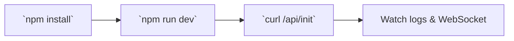
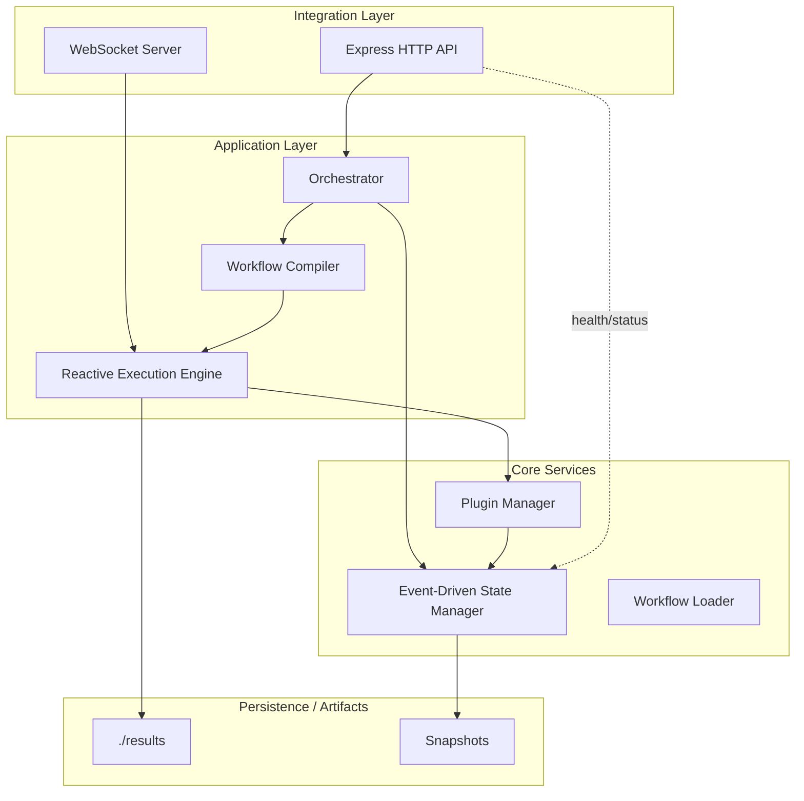
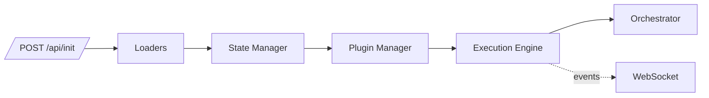
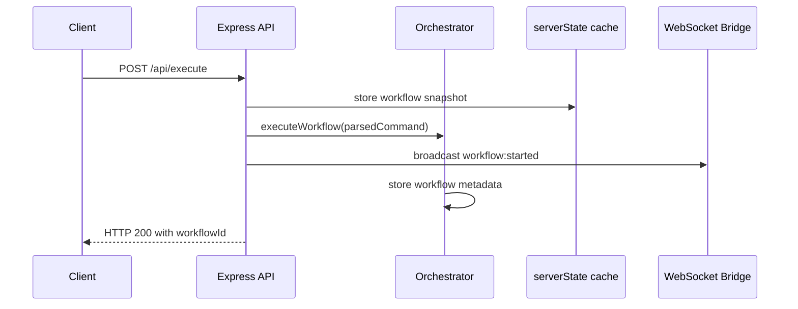
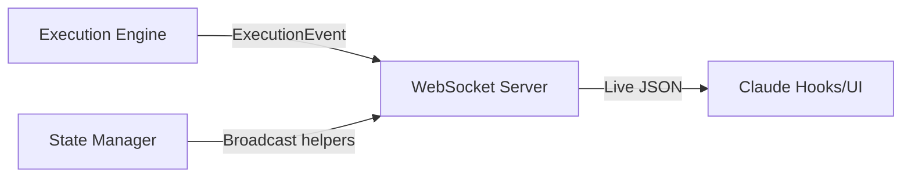
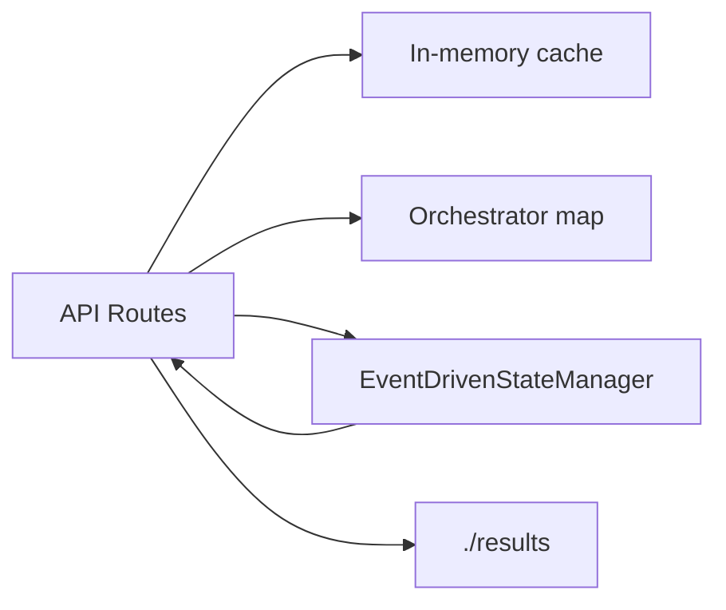
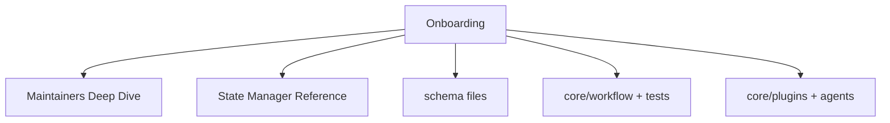

# Orchestrator V2 – Onboarding Guide

Welcome! This guide is the friendly tour that helps you understand **what this codebase does**, **how the pieces fit together**, and **where to look when you want to dig deeper**. If you later need a microscope instead of a map, jump to `docs/MAINTAINERS-DEEP-DIVE.md` for annotated source walk-throughs.

## Implementation Status Legend

Throughout this guide, you'll see these markers indicating implementation status:

- ✅ **Fully Implemented** – Working code you can run today
- 🚧 **Partially Implemented** – Infrastructure exists, but end-to-end flow incomplete
- 📋 **Planned** – Designed but not yet implemented

**Current State (as of 2025-09-30)**:
- ✅ HTTP API foundation (5 endpoints working)
- ✅ Workflow management and state tracking
- ✅ WebSocket real-time event broadcasting
- ✅ Plugin infrastructure (loader, manager, registry)
- ✅ Execution engine with RxJS-based scheduling
- 🚧 Task progression and agent handover (helpers exist, endpoints missing)
- 📋 Agent implementations (18 spec files, no executable code yet)
- 📋 Complete agent execution loop (requires `/api/agent-result` endpoint)

## Big Picture: From Claude Prompt to Finished Work
Think of the orchestrator as a production line for expert agents:
1. A Claude Code user types a request ("Fix the payment bug"). An external client (built using the SDK in `server/client/index.ts`) calls `/api/parse-command` to analyze the request, then `/api/execute` to start a workflow.
2. `/api/execute` kicks off the chosen workflow inside the orchestrator, creating a workflow state record.
3. The orchestrator identifies which agents should handle the work based on the workflow definition.
4. 🚧 **Currently in development**: The execution engine will coordinate agent execution, with each agent reporting results back through the API.
5. 📋 **Planned**: When the final step finishes, the orchestrator will send the combined result back to the client.

**Current Status**: The orchestrator provides the HTTP API foundation, workflow management, and state tracking. Agent execution coordination and the full task handover chain are partially implemented—the infrastructure exists but the complete end-to-end flow is still being built.

If you want to look under the hood, the "Behind the Scenes" section near the end explains each moving part in plain English.

## Quick Glossary (plain English)
- **Workflow** – a recipe of steps the system should complete (e.g., “analyse requirements → write code → review”).
- **Agent** – a specialised worker that can complete one of those steps (think “code reviewer” or “bug fixer”).
- **Orchestrator** – the air-traffic controller that keeps every workflow and agent on schedule.
- **State Manager** – the ledger that remembers every event so dashboards and APIs always know the latest truth.
- **Execution Engine** – the conductor that actually runs tasks in order and reports progress in real time.

Keep these metaphors handy—they make the diagrams below less intimidating.

## 1. First Run Checklist

1. Install dependencies once: `npm install`
2. Launch the dev server (serves HTTP + WebSocket): `npm run dev`
3. In a second terminal initialise the system:
   ```bash
   curl -X POST http://localhost:3001/api/init \
     -H 'content-type: application/json' \
     -d '{"logLevel":"info"}'
   ```
4. In the dev-server terminal you should see an “initialised” message and a reminder that the WebSocket lives at `ws://localhost:3002/ws`.

> **Why the extra curl?** Until `/api/init` runs, the orchestrator hasn’t loaded workflows, agents, or plugins. Think of it as switching the airport control tower from “night mode” to “fully staffed”.

## 2. Repository Map in Plain Language

| Folder / File | Metaphor | What you’ll find |
|---------------|----------|------------------|
| `server/index.ts` | Airport terminal | Handles incoming HTTP flights, broadcasts updates, talks to every subsystem. |
| `core/orchestrator.ts` | Control tower | Remembers which workflow is active and hands tasks to the execution engine. |
| `core/state/` | Ledger room | Event-sourced records of workflows/tasks/agents plus query helpers. |
| `core/execution/` | Conductor’s stand | RxJS-powered scheduler, retries, checkpointing, metrics. |
| `core/workflow/` | Recipe kitchen | Validates workflow definitions and translates them into executable plans. |
| `core/plugins/` & `agents/` | Hiring manager | Discovers agent capabilities and loads them on demand. |
| `tests/` | Wind tunnel | Mirrors the runtime layout so you can run targeted Jest suites (`state/`, `execution/`, `server/`, etc.). |

## 3. Boot Sequence (`POST /api/init`)

High-level story (full code lives in `server/index.ts`):
1. **Load blueprints** – `WorkflowLoader`, `AgentLoader`, and `CommandParser` initialise with baked-in defaults (so `/api/parse-command` can suggest the right workflow).
2. **Open the ledger** – `EventDrivenStateManager.initialize()` wires command/query/event handlers and sets up snapshot timers.
3. **Discover agents** – `PluginManager.initialize()` scans `./agents` for manifests.
4. **Warm up the engine** – `ReactiveExecutionEngine.initialize()` prepares the scheduler, retry/circuit-breaker, checkpointing, and monitoring modules.
5. **Open the radio** – `IntegrationWebSocketServer` + `StreamingBridge` start broadcasting execution events in real time.
6. **Tower online** – `Orchestrator.initialize()` stores callbacks so the server can hand it todos and results.

> **Mental image:** imagine the airport before sunrise—lights off, gates closed. `/api/init` flips everything on so the first flight (workflow) can take off.

## 4. One Workflow, End to End (`POST /api/execute`)

**✅ Currently Implemented:**


**📋 Planned (partial implementation exists):**
The complete agent execution loop with task handover, result collection, and automated progression through the workflow sequence.

### Current Implementation Flow:

1. **Request Processing** (✅ Implemented): The client calls `/api/execute` with `workflowType`, `taskDescription`, and optional `complexity`. The server stores a workflow record in `serverState.activeWorkflows` (server/index.ts:713-728).

2. **Complexity Analysis** (✅ Implemented): `ComplexityDetector.analyzeComplexity()` scores the request as simple/moderate/complex (server/index.ts:697-706).

3. **Orchestrator Handoff** (✅ Implemented): `Orchestrator.executeWorkflow()` stores workflow metadata and returns a workflow ID (core/orchestrator.ts:38-52).

4. **WebSocket Broadcast** (✅ Implemented): The server broadcasts `workflow:started` event so connected clients receive real-time updates (server/index.ts:744-749).

5. **Task Creation Helper** (🚧 Partially Implemented): `createNextTaskInSequence()` function exists (server/index.ts:246-347) to queue agent tasks based on workflow definitions, BUT:
   - Only 2 workflows are defined: 'bug-fix' and 'feature-development' (core/workflow-loader.ts:25-49)
   - Agent definitions are Markdown descriptions in `./agents`, not executable code

6. **Agent Execution** (📋 Planned): The following endpoints referenced in documentation are **NOT yet implemented**:
   - ~~`GET /api/next-task/:workflowId`~~ - to fetch pending tasks
   - ~~`POST /api/agent-result`~~ - to submit agent results
   - ~~`GET /api/status/:workflowId`~~ - to check workflow status
   - ~~`GET /api/workflows`~~ - to list all workflows

7. **Result Handling** (📋 Planned): Full result collection, artifact storage, and automatic workflow progression.

### What Works Today:

The currently implemented API endpoints are:
- ✅ `POST /api/init` - Initialize the orchestrator
- ✅ `POST /api/parse-command` - Parse natural language commands
- ✅ `POST /api/execute` - Start a workflow
- ✅ `GET /api/todos/:workflowId` - Retrieve todos for a workflow
- ✅ `GET /api/health` - Server health check

> **Try it yourself:** Run `POST /api/init` then `POST /api/execute`, then check `GET /api/health`. You'll see the workflow created and tracked in `activeWorkflows`.

## 5. How Real-Time Updates Work

- The execution engine emits detailed `ExecutionEvent`s (task started, task finished, error, etc.).
- `StreamingBridge` listens to those events and pushes them to every WebSocket client.
- Helper functions `broadcastWorkflowEvent`, `broadcastTaskEvent`, and `broadcastTodoUpdate` send extra signals when the HTTP layer changes state (e.g., new todos from Claude).
- Claude hooks or custom dashboards only need a single WebSocket subscription to stay informed—no need to poll.

**Experiment:** open `examples/websocket-test.html` in a browser while you run a workflow. Each event shows up as a coloured card in real time.

## 6. Data Sources at a Glance

| Store | Think of it as… | Why it matters |
|-------|-----------------|----------------|
| `serverState` | Whiteboard in the control room | Fast answers for APIs/UI: who’s active, which task is next, what todos remain. |
| `Orchestrator` map | Flight schedule | Minimal metadata so the control tower can answer “what’s running?”. |
| `EventDrivenStateManager` | Official ledger | Source of truth with history, metrics, and replay capability. |
| `./results` | Filing cabinet | Where result summaries or artefacts are written. |

When you add or change behaviour, make sure both the **whiteboard** (`serverState`) and the **ledger** (`EventDrivenStateManager`) stay aligned.

## 7. Where to Go Next

1. **Deep dive** – `docs/MAINTAINERS-DEEP-DIVE.md` shows the same flows with annotated source snippets.
2. **State ledger** – `docs/STATE-MANAGER-REFERENCE.md` catalogues every command, event, and query.
3. **HTTP contracts** – `server/schemas/api.ts` and `server/schemas/common.ts` document payloads. Great for tests and docs.
4. **Workflow DSL** – Explore `core/workflow/` plus `tests/workflow/` to see the recipe language and its test harnesses.
5. **Agent plugins** – Browse `core/plugins/` and the `agents/` directory to learn how new skills are registered.

You now have the lay of the land: start the server, run a workflow, watch the live updates, and then decide which subsystem you want to explore next. Welcome aboard!

## Behind the Scenes (Under-the-Hood Summary)
Here’s what actually happens inside, using everyday analogies:

| Stage | “Real world” metaphor | Key files |
|-------|-----------------------|-----------|
| Prompt intake | Passenger checks in at the airport | `server/index.ts` handles `/api/parse-command` and `/api/execute`. |
| Command parsing | Gate agent tags the luggage correctly | `core/command-parser.ts` turns natural language into a known workflow id. |
| Orchestrator setup | Control tower adds the flight to the schedule | `core/orchestrator.ts` records workflow metadata and keeps callbacks ready. |
| State logging | Ledger clerk writes each event | `core/state/event-driven-state-manager.ts` stores commands/events/metrics. |
| Workflow compilation | Recipe kitchen plans the meal | `core/workflow/compiler.ts` turns workflow definitions into executable plans. |
| Task execution | Orchestra conductor cues each musician | `core/execution/reactive-execution-engine.ts` schedules agents, handles retries, streams telemetry. |
| Agent execution | Specialists do the actual work | `agents/` and `core/plugins/` register and run capabilities. |
| Live updates | Airport departure board | `core/integration/streaming-bridge.ts` + helper broadcasts push events over WebSocket. |

When you’re ready to dive further, open `docs/MAINTAINERS-DEEP-DIVE.md`—every section there walks through these same stages with highlighted code snippets and file references.
