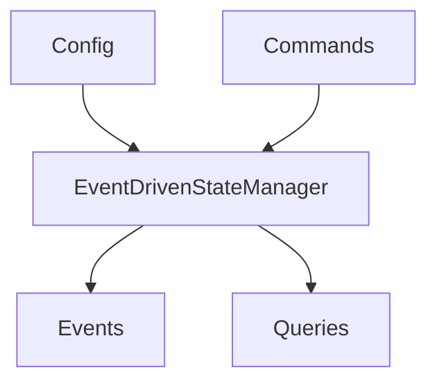
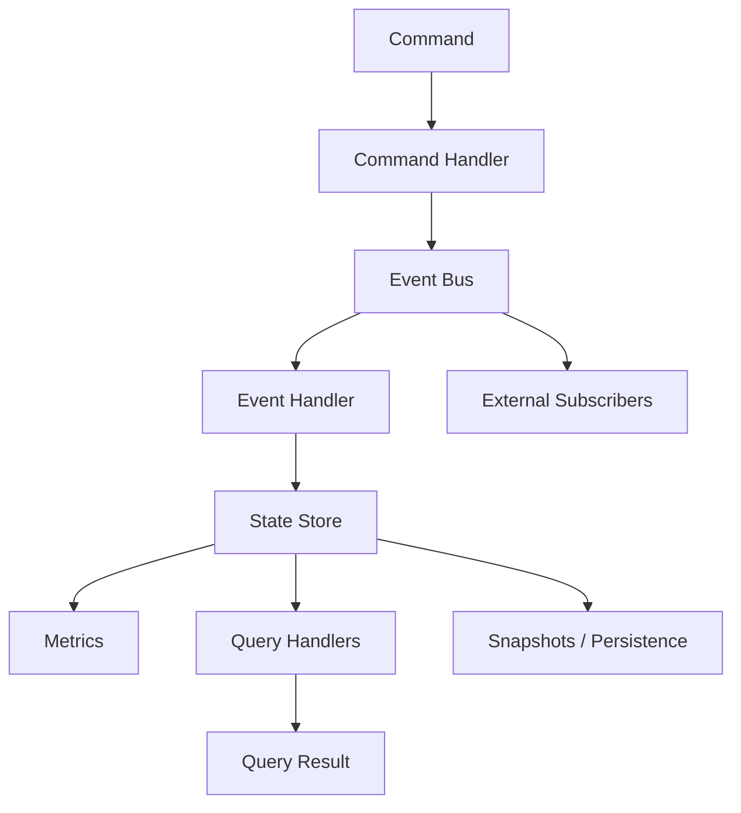
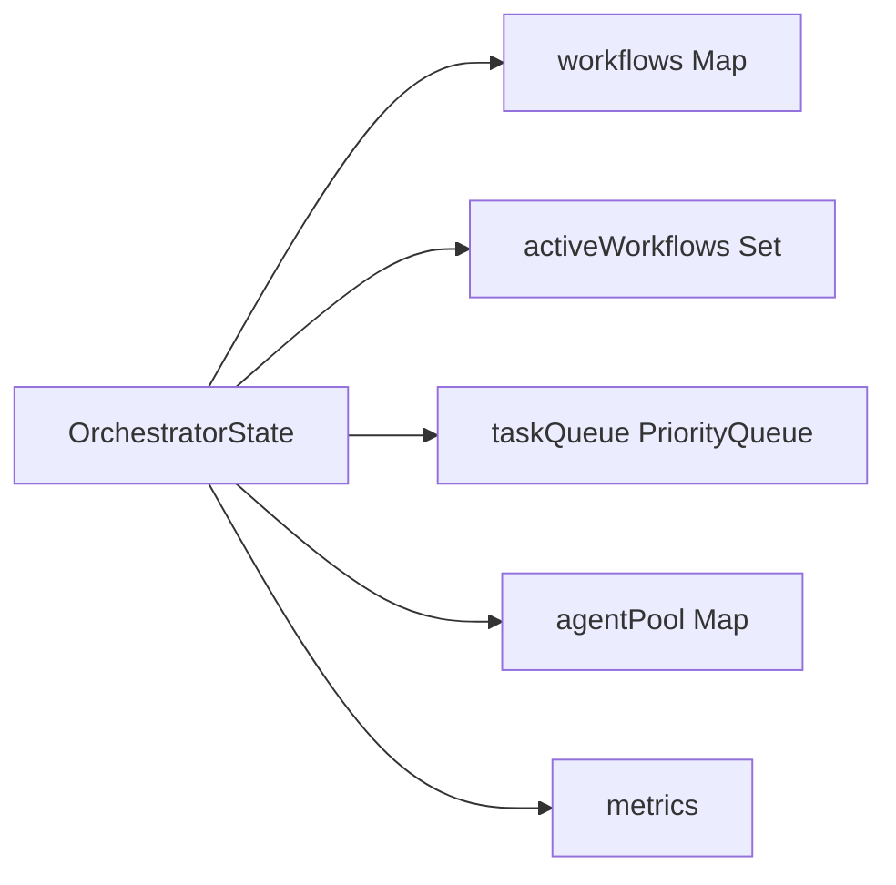
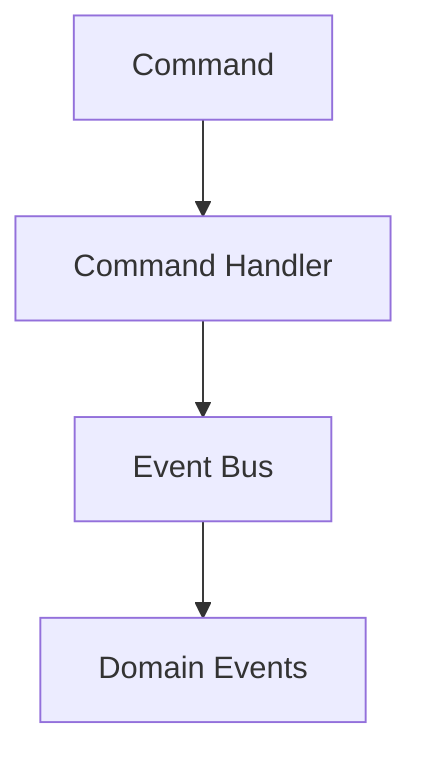
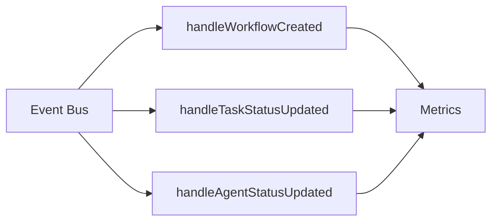
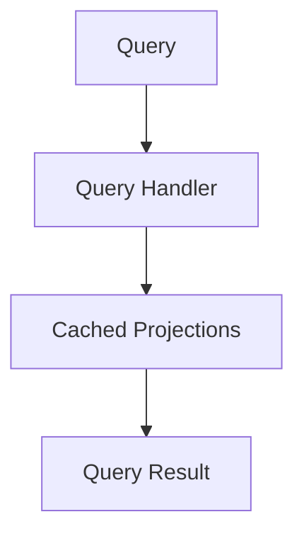
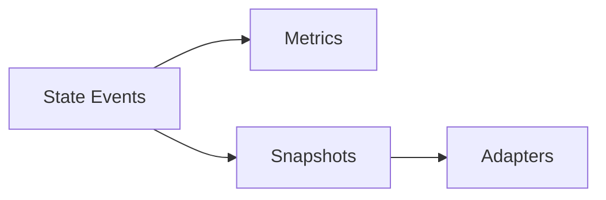
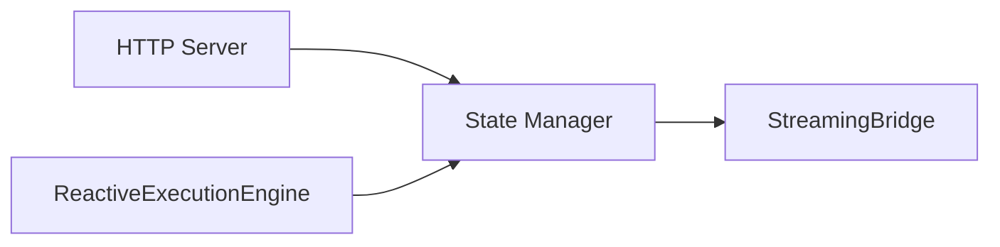
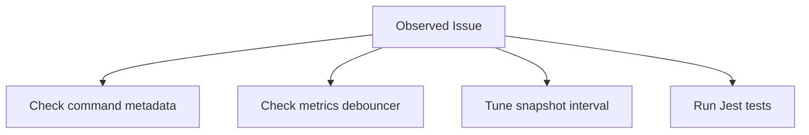

# EventDrivenStateManager (State Architecture Overview)

This document explains how the V2 state layer works today so you can reason about commands, events, queries, and persistence without spelunking through `core/state/event-driven-state-manager.ts` each time.

## 1. First Look

- Entry point: `new EventDrivenStateManager(config?)`
- Core responsibilities:
  - Enforce CQRS: `executeCommand` mutates state, `executeQuery` reads projections.
  - Emit strongly typed domain events (`WorkflowCreated`, `TaskStatusUpdated`, …) through an internal `EventBus`.
  - Maintain cached projections (`workflows`, `taskQueue`, `agentPool`, metrics) for fast queries.
  - Optionally persist snapshots / event history (toggle with config flags).
- Quick experiment:
  ```ts
  const manager = new EventDrivenStateManager({ enableLogging: false });
  manager.on('WorkflowCreated', evt => console.log(evt.payload.id));
  await manager.createWorkflow({ id: 'wf-1', name: 'demo', description: '', status: 'pending', tasks: new Map(), agents: new Map(), taskOrder: [], context: {}, variables: {}, checkpoints: [], createdAt: new Date(), updatedAt: new Date(), lastModifiedAt: new Date(), createdBy: 'system', tags: [], metadata: {} });
  ```

## 2. Architecture At A Glance


| Piece | Location | Purpose |
|-------|----------|---------|
| Command handlers | `event-driven-state-manager.ts` (private classes) | Validate payloads, emit domain events |
| Event bus | `core/state/events/event-bus.ts` | Prioritised pub/sub with RxJS backing |
| Event handlers | `handleWorkflowCreated`, etc. | Update in-memory projections + metrics |
| State store | `OrchestratorState` | Maps of workflows, agents, tasks, priority queue |
| Query handlers | `registerQueryHandlers()` | Project state into DTOs for callers |
| Persistence hooks | `scheduleSnapshots`, `eventHistory` | Optional durability and replay |

## 3. State Structure

`OrchestratorState` is defined in `core/state/types.ts`.

| Field | Type | Details |
|-------|------|---------|
| `workflows` | `Map<WorkflowId, WorkflowState>` | Authoritative workflow aggregates |
| `activeWorkflows` | `Set<WorkflowId>` | Shortcut for queries/scheduling |
| `completedWorkflows` | `Set<WorkflowId>` | Used for metrics and clean-up |
| `taskQueue` | `PriorityQueue<TaskState>` | Tasks sorted by priority (lower number = higher priority) |
| `agentPool` | `Map<AgentName, AgentState>` | Tracks agent health + utilisation |
| `globalContext` | `Record<string, any>` | Shared runtime metadata |
| `metrics` | `SystemMetrics` | Totals, throughput, agent utilisation, lastUpdated |

`WorkflowState` embeds nested maps (`tasks`, `agents`), timestamps, metadata, and checkpoint history. Validators live in `core/state/schemas.ts` (Zod).

## 4. Command Pipeline

Commands always go through `executeCommand(Command)`.

### Registered Command Types
| Command | Handler class | Emits event(s) | Notes |
|---------|---------------|----------------|-------|
| `CreateWorkflow` | `CreateWorkflowHandler` | `WorkflowCreated` | Builds default aggregate, marks workflow pending |
| `UpdateWorkflowStatus` | `UpdateWorkflowStatusHandler` | `WorkflowStatusUpdated` | Handles RUNNING / COMPLETED / FAILED / CANCELLED transitions |
| `CreateTask` | `CreateTaskHandler` | `TaskCreated` | Enqueues task, attaches metadata |
| `UpdateTaskStatus` | `UpdateTaskStatusHandler` | `TaskStatusUpdated` | Accepts output/error payload |
| `AssignAgent` | `AssignAgentHandler` | `AgentAssigned` | Associates agent-name with task/workflow |
| `UpdateAgentStatus` | `UpdateAgentStatusHandler` | `AgentStatusUpdated` | Updates agent pool + metrics |
| `CompleteWorkflow` | `CompleteWorkflowHandler` | `WorkflowStatusUpdated` | Convenience to mark completed |
| `FailWorkflow` | `FailWorkflowHandler` | `WorkflowStatusUpdated` | Marks failed, increments counters |
| `CancelWorkflow` | `CancelWorkflowHandler` | `WorkflowStatusUpdated` | Graceful cancellation |
| `UPDATE_EXECUTION_STATE` | `UpdateExecutionStateHandler` | `ExecutionStateUpdated` | Used by execution engine to sync progress (optional) |

Public helpers like `createWorkflow`, `updateWorkflowStatus`, `updateTask`, `deleteWorkflow` call into the same command pipeline to keep everything event sourced.

### Command Metadata
Each command includes a `metadata.correlationId` (required) so you can tie requests back to HTTP logs. Other optional fields: `userId`, `workflowId`, `expectedVersion`, `priority`, `timeout`.

## 5. Event Flow

`EventBus.publish(StateEvent)` feeds a Subject stream. `registerEventHandlers()` subscribes to the following domain events:

| Event type | Handler | Side effects |
|------------|---------|--------------|
| `WorkflowCreated` | `handleWorkflowCreated` | Adds workflow to maps, flags as active, refreshes metrics |
| `WorkflowStatusUpdated` | `handleWorkflowStatusUpdated` | Moves IDs between `active`/`completed`, updates timestamps |
| `TaskCreated` | `handleTaskCreated` | Adds task to workflow, pushes into `taskQueue` |
| `TaskStatusUpdated` | `handleTaskStatusUpdated` | Updates task record, calculates durations, metrics |
| `AgentAssigned` | `handleAgentAssigned` | Tracks agent assignment, increments counts |
| `AgentStatusUpdated` | `handleAgentStatusUpdated` | Refreshes agent health and utilisation |
| `ExecutionStateUpdated` | `handleExecutionStateUpdated` | Syncs execution phase metadata (when used) |

`changeSubject` debounces high-frequency updates and keeps `metrics` fresh without hammering subscribers.

External listeners can register via `stateManager.on(eventType, handler)` / `off`. These proxies call straight into the underlying `EventBus`.

## 6. Query Pipeline

Queries route through `executeQuery(Query)` and the handlers registered in `registerQueryHandlers()`.

| Query | Result shape | Description |
|-------|--------------|-------------|
| `GetWorkflow` | `WorkflowState` | Returns full aggregate by ID |
| `GetWorkflowsByStatus` | `WorkflowState[]` | Filters using active/completed sets |
| `GetActiveWorkflows` | `WorkflowState[]` | Convenience alias |
| `GetTask` | `TaskState` | Searches across all workflows |
| `GetTaskQueue` | `TaskState[]` | Snapshot of current priority queue |
| `GetAgent` | `AgentState` | Looks up by agent name |
| `GetAgentUtilization` | `{ name, utilisation }[]` | Derived from `metrics.agentUtilization` |
| `GetMetrics` | `SystemMetrics` | Aggregated counters and throughput |

Each handler can leverage cached projections or recompute from the base state. Pagination/filters can be extended through the `criteria` and `projection` fields on the `Query` object.

## 7. Metrics & Snapshots

- Metrics fields (totals, completions, throughput, error rate, agent utilisation) recalc on every debounced state change.
- Snapshots are optional: enable with `enableSnapshots` + configure `snapshotInterval` / `maxEventHistory`.
  - Snapshots store `StateSnapshot` objects with a version counter.
  - `eventHistory` keeps a rolling buffer (default 10k events) for debugging or replay.
- Persistence adapters under `core/state/persistence/` (Redis, SQLite) can be hooked in via config to swap storage backends.

## 8. Integration Touchpoints

- **HTTP Server (`server/index.ts`)**
  - Calls `stateManager.initialize()` during `/api/init`.
  - Uses `updateWorkflowStatus` when marking workflows completed/failed/cancelled.
  - Reads state via `listWorkflows`, `getWorkflow` for debug endpoints.
- **ReactiveExecutionEngine**
  - Injected via constructor options; emits `UPDATE_EXECUTION_STATE` commands and listens for task events.
- **StreamingBridge / WebSocket helpers**
  - Subscribe to task/workflow events emitted by the state manager (via `.on` or direct bus subscription) to push real-time updates.

## 9. Troubleshooting & Tips

- **Missing events?** Ensure commands carry a `correlationId`. Without it, handlers can still run but tracing is harder.
- **Metrics out of sync?** Check that `changeSubject` subscribers haven’t been torn down; re-initializing the manager resets the BehaviorSubject and Subject.
- **Large workflows?** Increase `snapshotInterval` and persist snapshots to Redis/SQLite to avoid replaying thousands of events on restart.
- **Testing** – `tests/state/event-driven-state-manager.test.ts` covers core scenarios: creation, status changes, task lifecycle, agent updates, metrics.
- **Logging** – Set `enableLogging: true` in config to surface debug logs from both the state manager and event bus (uses winston).

## 10. Reference
- Source: `core/state/event-driven-state-manager.ts`
- Types: `core/state/types.ts`
- Schemas: `core/state/schemas.ts`
- Event bus implementation: `core/state/events/event-bus.ts`
- Persistence adapters: `core/state/persistence/*`
- Tests: `tests/state/event-driven-state-manager.test.ts`

Use this document alongside `docs/ONBOARDING-GUIDE.md` and `docs/MAINTAINERS-DEEP-DIVE.md` to move from the big picture down into the state manager internals.
