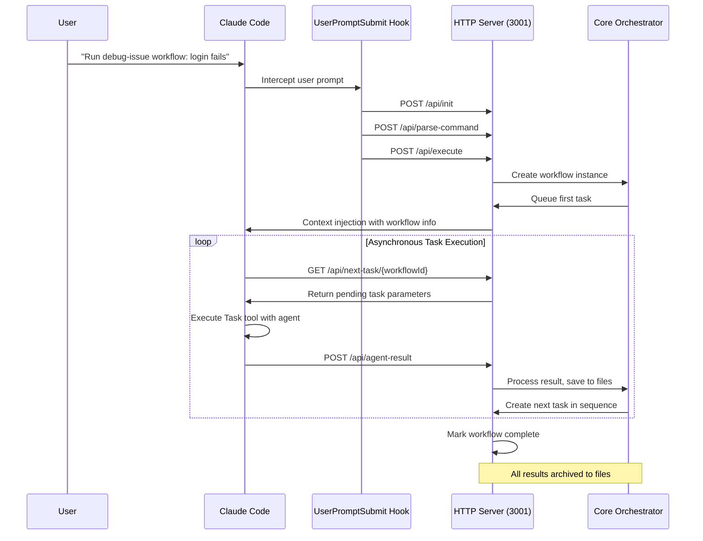

# Orchestration System Architecture

## Overview

The Claude Code Orchestration System is a TypeScript-based orchestration framework with HTTP server integration and real-time Claude Code hooks. The system provides automated workflow execution through agent task chaining with comprehensive state management and file-based result persistence.

**Production Implementation**: Complete TypeScript core framework with 9 YAML workflow definitions and 18 agent definitions (6 agents × 3 complexity levels). Production HTTP server (port 3001) managing asynchronous agent execution through hook integration. Enhanced orchestration with UserPromptSubmit hook coordinating workflow execution via task discovery and result submission.

## System Components

```
┌─────────────────────────────────────────────────────────────────┐
│                  Claude Code Interface                          │
│  ┌─────────────────────────────────────────────────────────────┐ │
│  │ UserPromptSubmit Hook (orchestrator-hook.js)               │ │
│  │ • Detects workflow commands                                 │ │
│  │ • Initializes workflows via HTTP API                       │ │
│  │ • Injects context for Claude Code execution                │ │
│  └─────────────────────┬───────────────────────────────────────┘ │
└───────────────────────┼─────────────────────────────────────────┘
                        │ HTTP calls (/api/init, /api/execute)
                        ▼
┌─────────────────────────────────────────────────────────────────┐
│              HTTP Server (server/main.js - port 3001)          │
│  ┌─────────────────┐              ┌─────────────────────────────┐│
│  │ API Endpoints   │              │  Task Queue &               ││
│  │ • /api/init     │◄────────────►│  Asynchronous Agent         ││
│  │ • /api/execute  │              │  Coordination               ││
│  │ • /api/agent-   │              │  • Workflow state mgmt      ││
│  │   result        │              │  • Task chaining            ││
│  └─────────────────┘              └─────────────────────────────┘│
└─────────────────────┬───────────────────────────────────────────┘
                      │ Manages TypeScript core orchestrator
                      ▼
┌─────────────────────────────────────────────────────────────────┐
│            TypeScript Core Framework (core/)                   │
│  ┌─────────────┐ ┌─────────────┐ ┌─────────────┐ ┌─────────────┐│
│  │ Orchestrator│ │ State Mgmt  │ │ Agent Loader│ │ Result Mgmt ││
│  │ Engine      │ │ & Progress  │ │ & Workflow  │ │ & Handover  ││
│  │             │ │ Tracking    │ │ Loading     │ │ Chains      ││
│  └─────────────┘ └─────────────┘ └─────────────┘ └─────────────┘│
└─────────────────────┬───────────────────────────────────────────┘
                      │ Claude Code task discovery & execution
                      ▼
┌─────────────────────────────────────────────────────────────────┐
│              Agent Execution (via Claude Code)                 │
│ ┌─────────────┐ ┌─────────────┐ ┌─────────────┐ ┌─────────────┐ │
│ │ Backend     │ │ Frontend    │ │ Issue       │ │ Code        │ │
│ │ Architect   │ │ Developer   │ │ Detective   │ │ Reviewer    │ │
│ │ (3 levels)  │ │ (3 levels)  │ │ (3 levels)  │ │ (3 levels)  │ │
│ └─────────────┘ └─────────────┘ └─────────────┘ └─────────────┘ │
└─────────────────────────────────────────────────────────────────┘
```

## Layer 1: TypeScript Core Framework (`/core/`)

### Purpose
- **Complete orchestration infrastructure** with type safety
- **Workflow execution engine** with state management
- **Agent coordination** and result processing
- **File-based persistence** and handover chains

### Core Components
- **orchestrator.ts**: Main orchestration engine with full feature set
- **simple-orchestrator.ts**: Streamlined orchestration for simplified workflows
- **workflow-loader.ts**: YAML workflow definition loading and validation
- **agent-loader.ts**: Agent definition loading with complexity level support
- **workflow-state-manager.ts**: Persistent workflow state tracking
- **simplified-state-manager.ts**: Streamlined state management
- **unified-state-manager.ts**: Unified state access layer
- **result-file-manager.ts**: File-based agent result storage
- **handover-chain.ts**: Inter-agent context and result passing
- **progress-tracker.ts**: TodoWrite integration and progress updates
- **claude-integration.ts**: Claude Code Task tool integration
- **command-parser.ts**: Natural language workflow command parsing
- **complexity-detector.ts**: Automatic task complexity detection
- **server-logger.ts**: Structured logging with correlation IDs

### Configuration Data
- **workflows/**: 9 YAML files defining agent sequences and parameters
- **agents/**: 18 Markdown files with agent prompts (6 agents × 3 complexity levels)

### Workflow Structure
```yaml
name: "Workflow Name"
description: "Brief description"
use_case: "When to use this workflow"

agents:
  sequence:
    - name: agent-name
      description: "What this agent does"
      timeout: "30m"
      required: true

    - name: parallel_group
      type: parallel
      agents:
        - name: backend-developer
        - name: frontend-developer

context:
  template: |
    # Task: {{task_description}}
    Type: {{workflow_type}}
    Started: {{timestamp}}

    ## Progress Tracking
    [Agent status updates]

examples:
  - "Example command 1"
  - "Example command 2"
```

## Layer 2: HTTP Server & Hook Integration (`/server/` and `/hooks/`)

### Purpose
- **Production deployment runtime** (JavaScript)
- **Real-time Claude Code integration** via hooks
- **HTTP API** for workflow management and task coordination
- **Asynchronous agent execution** with result processing

### Server Components

#### 1. HTTP Server (`server/main.js`)
- **Express server on port 3001**
- **RESTful API endpoints** for workflow management
- **Task queue coordination** with in-memory state
- **File-based result persistence**
- **Automatic task chaining** and workflow progression

#### 2. UserPromptSubmit Hook (`hooks/orchestrator-hook.js`)
- **Workflow command detection** from user prompts
- **Natural language pattern matching**
- **HTTP API initialization** and workflow execution
- **Context injection** for Claude Code guidance

#### 3. Supporting Hooks
- **task-result-capture.js**: Legacy task result processing
- **manual-task-completion-hook.js**: Manual workflow control
- **test-hook-detection.js**: Development testing support

### API Endpoints
- **POST /api/init**: Initialize orchestrator server
- **POST /api/parse-command**: Parse workflow commands
- **POST /api/execute**: Start workflow execution
- **GET /api/next-task/{workflowId}**: Get pending tasks for Claude
- **POST /api/agent-result**: Submit agent execution results
- **GET /api/status/{workflowId}**: Get workflow status
- **GET /api/workflows**: List active workflows
- **GET /api/health**: Server health check
- **Debug endpoints**: Comprehensive debugging and recovery tools

## Hook Integration Architecture

### Enhanced Orchestration Flow



### Hook Components

#### 1. UserPromptSubmit Hook (`orchestrator-hook.js`)
- **Trigger**: Every user prompt submission
- **Function**: Detects workflow command patterns
- **Action**: Initializes workflows on server via HTTP
- **Patterns**: "Run [type] workflow:", natural language detection

#### 2. Task Result Processing
- **Method**: Direct HTTP submission via `/api/agent-result`
- **Trigger**: Claude Code submits results after Task tool execution
- **Function**: Asynchronous result processing and file storage
- **Action**: Automatic next task creation and workflow progression

## Data Flow

### 1. Command Processing (Hook-Enhanced)
```
User Command → UserPromptSubmit Hook → HTTP Server (/api/init, /api/parse-command, /api/execute) → Core Orchestrator → First Task Creation
```

### 2. Asynchronous Task Execution (Claude Discovery)
```
Claude Code → /api/next-task → Server → Task Parameters → Claude Task Tool → Agent Execution → /api/agent-result → Server
```

### 3. Automatic Workflow Progression (Server-Managed)
```
Agent Result → File Storage → Handover Creation → Next Task Generation → Task Queue → Repeat Until Complete
```

### 4. State Management (Multi-Layer Persistence)
```
HTTP Server (In-Memory) ↔ Core Orchestrator (TypeScript State) ↔ File System (/state/, /archive/)
Workflow State Files ↔ Result Files ↔ Handover Chain Files
TodoWrite Integration ↔ Real-time Progress Updates ↔ Claude Code UI
```

## Agent Chaining & Result Management

### Implementation
The framework implements a complete agent chaining mechanism enabling communication and context sharing between agents through a comprehensive file-based result management system. This infrastructure ensures agents have access to previous work products and outputs throughout workflow execution.

### File-Based Result Storage

#### Result Files vs Handover Files
The system maintains two distinct types of files to manage agent communication:

**Result Files** (`workflows/*/results/{stepIndex}-{agentName}/result.json`)
- **Purpose**: Complete historical record of agent execution
- **Audience**: System archival, audit trail, metrics collection
- **Content**: Full agent outputs, metrics, artifacts, and performance data
- **Lifecycle**: Permanent archive, never modified after creation
- **Used By**: Archive system, debugging, workflow analysis

**Handover Files** (`workflows/*/handover/{stepIndex}-{fromAgent}-to-{toAgent}.json`)
- **Purpose**: Curated context transfer between agents
- **Audience**: Next agent(s) in the workflow sequence
- **Content**: Specific instructions, key points, and structured data for next steps
- **Lifecycle**: Created for each agent transition, read by subsequent agents
- **Used By**: Agents during execution to understand previous work

#### File Structure Organization
```
workflows/
├── active/{workflowId}/                    # Active workflow execution
│   ├── index.json                          # Workflow metadata and agent registry
│   ├── results/                            # Complete agent outputs
│   │   ├── 00-{agentName}/
│   │   │   ├── result.json                 # Structured agent output
│   │   │   ├── summary.md                  # Human-readable summary
│   │   │   └── artifacts/                  # Generated files and assets
│   │   └── 01-{agentName}/
│   │       └── ...
│   └── handover/                           # Inter-agent communication
│       ├── 00-{fromAgent}-to-{toAgent}.json    # Structured handover data
│       ├── 00-{fromAgent}-to-{toAgent}.md      # Human-readable handover
│       └── parallel-shared.json                # Shared context for parallel agents
└── completed/{workflowId}/                 # Archived completed workflows
    └── [same structure as active]
```

### Agent Communication Flow

#### Sequential Agent Execution
```
1. Agent A executes task
   ↓
2. ResultFileManager saves complete output to result.json
   ↓
3. HandoverChain creates curated handover files for Agent B
   ↓
4. Agent B reads previous results + handover instructions
   ↓
5. Agent B executes with full context of Agent A's work
   ↓
6. Process repeats for subsequent agents
```

#### Context Building Process
```typescript
// 1. Read previous agent results
const previousResults = await resultManager.readPreviousResults(workflowId, currentStep);

// 2. Create handover chain for current agent
await handoverChain.createHandoverFromResults(workflowId, agentName, stepIndex, previousResults);

// 3. Generate context with file references
const contextWithFiles = handoverChain.generateContextWithReferences(workflowId, agentName, previousResults);

// 4. Agent receives both structured data and file references
const agentPrompt = buildAgentPromptWithFiles(agent, contextWithFiles, previousResults);
```

#### Handover Data Structure
```typescript
interface HandoverData {
  forAgent: string[];           // Target agents for this handover
  keyPoints: string[];          // Critical information from previous agent
  dependencies: string[];       // Required previous work references
  data: Record<string, any>;    // Structured data to pass forward
  instructions: string;         // Specific instructions for next agent
}

interface HandoverLink {
  fromAgent: string;           // Source agent
  toAgent: string;            // Target agent
  stepIndex: number;          // Position in workflow
  data: HandoverData;         // Handover content
  timestamp: string;          // Creation time
  filePath: string;          // File system location
}
```

#### Result Data Structure
```typescript
interface StructuredAgentResult {
  agent: string;              // Agent identifier
  timestamp: string;          // Execution timestamp
  status: 'completed' | 'failed' | 'running';
  stepIndex: number;          // Position in workflow
  workflowId: string;         // Parent workflow
  output: any;               // Complete agent output
  artifacts: Record<string, string>;  // Generated files mapping
  handover: HandoverData;     // Embedded handover information
  metrics: {                  // Performance metrics
    duration: number;
    filesCreated?: number;
    tokensUsed?: number;
    linesOfCode?: number;
  };
  summary: string;           // Human-readable summary
}
```

### Parallel Agent Coordination

#### Shared Context Management
For parallel agent execution, the system creates a shared context file:
```
handover/parallel-shared.json:
{
  workflow: "workflowId",
  currentStep: 2,
  availableResults: [
    {
      agent: "backend-architect",
      step: 0,
      resultPath: "results/00-backend-architect",
      keyPoints: ["API design completed", "Database schema defined"],
      artifacts: {"api-spec.yaml": "path/to/spec"}
    }
  ],
  timestamp: "2025-09-20T17:46:38.750Z"
}
```

#### Synchronization Points
```typescript
// Parallel agents execute simultaneously
await Promise.all([
  executeSingleAgent(workflowId, 1, javaBackendAgent, 1),
  executeSingleAgent(workflowId, 1, nextjsFrontendAgent, 1)
]);

// Both agents have access to:
// 1. Previous sequential agent results
// 2. Shared parallel context
// 3. Individual handover instructions
```

### State Management Integration

#### Workflow State Tracking
```typescript
interface WorkflowState {
  id: string;
  workflowName: string;
  status: 'pending' | 'running' | 'completed' | 'failed';
  stepStates: StepState[];     // Individual agent states
  context: Record<string, any>; // Workflow-level context
}

interface StepState {
  index: number;
  agentName: string;
  status: 'pending' | 'running' | 'completed' | 'failed';
  startTime?: Date;
  endTime?: Date;
  result?: string;             // Reference to result file location
  error?: string;
}
```

#### Archive Management
```typescript
// Workflow completion process:
1. All agents complete execution
2. Final state updated to 'completed'
3. ResultFileManager archives workflow results
4. WorkflowStateManager archives state file
5. Files moved from workflows/active/ to workflows/completed/
6. Archive metadata updated with completion statistics
```

### Error Handling & Recovery

#### Agent Failure Scenarios
```typescript
// If an agent fails:
1. Error captured in result.json with status: 'failed'
2. Handover files still created with available partial results
3. Subsequent agents receive error context and partial outputs
4. Workflow can continue with optional agents or halt for required agents
```

#### State Recovery
```typescript
// System can recover from failures:
1. Read archived workflow state
2. Identify last successful agent
3. Resume from next agent in sequence
4. Previous results remain available for context
```

### Performance Characteristics

#### File I/O Optimization
- **Result writes**: Atomic operations with proper error handling
- **Handover creation**: Asynchronous with batching for parallel agents
- **Context reading**: Cached previous results within workflow execution
- **Archive operations**: Background processing after workflow completion

#### Memory Management
- **Streaming**: Large result files handled with streaming I/O
- **Garbage collection**: Temporary files cleaned up after handover creation
- **Result caching**: Previous results cached in memory during workflow execution

## Agent Architecture

### Complexity-Based Agent System

The system implements a three-tier complexity detection system that automatically selects appropriate agent templates based on task description analysis:

#### Complexity Levels
- **SIMPLE**: Basic tasks, prototypes, dummy implementations, quick tests
- **MODERATE**: Standard implementation tasks with reasonable best practices
- **COMPLEX**: Production-ready implementations with full enterprise considerations

#### Specialized Agents (6 types × 3 complexity levels = 18 agent definitions)

1. **backend-architect**
   - **Simple**: Basic system design concepts
   - **Moderate**: Standard architecture patterns and API design
   - **Complex**: Enterprise architecture, performance, and scalability

2. **java-backend-developer**
   - **Simple**: Basic Java implementations
   - **Moderate**: Spring Boot with standard patterns
   - **Complex**: Production-ready with DDD, security, monitoring

3. **nextjs-react-developer**
   - **Simple**: Basic React components
   - **Moderate**: Next.js with TypeScript and best practices
   - **Complex**: Performance-optimized, scalable frontend architecture

4. **code-reviewer**
   - **Simple**: Basic code review checklist
   - **Moderate**: Security and quality analysis
   - **Complex**: Comprehensive production readiness review

5. **e2e-test-architect**
   - **Simple**: Basic test scenarios
   - **Moderate**: Comprehensive testing strategy
   - **Complex**: Enterprise testing with CI/CD integration

6. **issue-detective**
   - **Simple**: Basic problem identification
   - **Moderate**: Systematic investigation approaches
   - **Complex**: Advanced root cause analysis and recovery

### Agent Communication Patterns

#### Sequential Execution
```
Agent 1 → Context File → Agent 2 → Context File → Agent 3
```

#### Parallel Execution
```
        ┌─ Agent A ─┐
Input → ├─ Agent B ─┤ → Synchronization → Next Step
        └─ Agent C ─┘
```

#### Conditional Execution
```
Agent → Decision Point → Agent X (if condition)
                     → Agent Y (else)
```

## Error Handling Strategy

### Error Types
1. **Validation Errors**: Schema validation failures
2. **Execution Errors**: Agent failures or timeouts
3. **System Errors**: File system or network issues
4. **Recovery Errors**: Failed retry attempts

### Recovery Mechanisms
1. **Automatic Retry**: Configurable retry attempts with exponential backoff
2. **Graceful Degradation**: Optional agents can fail without stopping workflow
3. **State Preservation**: Workflow state saved for manual recovery
4. **Error Propagation**: Clear error messages with suggested actions

## Performance Characteristics

### Design Targets
The system is designed for these performance characteristics:
- **Workflow Loading**: Fast YAML parsing and validation
- **Command Parsing**: Efficient natural language pattern matching
- **Schema Validation**: Quick workflow structure verification
- **State Management**: Minimal overhead for state updates

### Scalability Considerations
- **Concurrent Workflows**: Configurable parallel agent limits
- **Memory Efficiency**: Lightweight TypeScript framework
- **File System**: Efficient result storage and archival
- **Modularity**: Independent component scaling

## Security Considerations

### Input Validation
- **Schema validation** for all workflow definitions
- **Sanitization** of user commands
- **Path validation** for file operations

### Access Control
- **File system permissions** respected
- **No network access** from workflows
- **Sandboxed execution** for agents

### Error Information
- **No sensitive data** in error messages
- **Sanitized logs** for debugging
- **Secure context** preservation

## Configuration Management

### Environment Variables
```bash
CLAUDE_ORCHESTRATION_LOG_LEVEL=info
CLAUDE_ORCHESTRATION_MAX_AGENTS=3
CLAUDE_ORCHESTRATION_TIMEOUT=1800000
```

### Configuration Files
- `package.json`: Dependencies and scripts
- `tsconfig.json`: TypeScript compilation settings
- `schemas/`: JSON Schema definitions

## Integration Points

### Claude Code Integration

#### TypeScript Core Framework (Development)
- **Orchestrator Classes**: Direct TypeScript orchestration engine access
- **Task Tool Integration**: Native agent execution via Claude's Task tool
- **TodoWrite Integration**: Real-time progress tracking and UI updates
- **File-based State**: Persistent workflow and result storage
- **Development Mode**: Direct TypeScript execution for testing

#### Production HTTP Server Deployment
- **Compiled JavaScript**: TypeScript core compiled to `/dist/` for runtime
- **Express HTTP Server**: RESTful API on port 3001 for production deployment
- **UserPromptSubmit Hook**: Automatic workflow detection from user commands
- **Asynchronous Task Discovery**: Claude Code discovers tasks via HTTP API endpoints
- **Result Submission**: Direct HTTP submission via `/api/agent-result`
- **No Hook Dependencies**: No PostToolUse hook required - direct API communication
- **State Persistence**: Multi-layer state management with file archival

#### Integration Architecture
- **Command Flow**: User → Hook → Server → Orchestrator → Task Queue
- **Task Flow**: Claude → API Discovery → Task Execution → Result Submission → Next Task
- **State Flow**: In-Memory → File System → Archive → Recovery
- **Progress Flow**: Orchestrator → TodoWrite → Claude Code UI Updates

**Production Status**: Full production deployment with HTTP server, hook integration, automated task chaining, and comprehensive state management

### External Dependencies
- **js-yaml**: YAML parsing
- **Node.js**: Runtime environment
- **TypeScript**: Type safety and compilation

## Monitoring and Observability

### Logging Strategy
- **Structured logging** with correlation IDs
- **Performance metrics** for optimization
- **Error tracking** for reliability

### Metrics Collection
- **Workflow success rates**
- **Agent execution times**
- **Error frequency and patterns**
- **Resource utilization**

## Deployment Architecture

### Framework Structure
```
orchestrator/
├── core/                   # TypeScript orchestration framework
│   ├── orchestrator.ts     # Main orchestration engine
│   ├── simple-orchestrator.ts  # Simplified orchestration
│   ├── workflow-loader.ts  # YAML workflow loading
│   ├── agent-loader.ts     # Agent definition loading
│   ├── *-manager.ts        # State and result management
│   ├── claude-integration.ts   # Claude Code integration
│   ├── server-logger.ts    # Structured logging
│   ├── monitoring/         # Logging and metrics
│   ├── config/             # Configuration constants
│   └── schemas/            # JSON schema definitions
├── dist/                   # Compiled JavaScript output
├── server/                 # HTTP server runtime
│   ├── main.js             # Production HTTP server
│   └── simplified.js       # Simplified server variant
├── hooks/                  # Claude Code hook integration
│   ├── orchestrator-hook.js     # UserPromptSubmit hook
│   └── task-result-capture.js   # Legacy result processing
├── workflows/              # YAML workflow definitions (9 files)
├── agents/                 # Agent definitions (18 files: 6×3 levels)
├── state/                  # Runtime workflow state files
├── archive/                # Completed workflow archives
├── logs/                   # Server and orchestration logs
├── metrics/                # Performance metrics data
├── docs/                   # Documentation
│   ├── ARCHITECTURE.md     # This document
│   ├── API.md              # HTTP API reference
│   └── *.md                # Other documentation
├── scripts/                # Utility scripts
├── tests/                  # Test files
├── package.json            # Dependencies and npm scripts
├── tsconfig.json           # TypeScript configuration
└── README.md               # User guide and setup
```

### Integration Considerations
- **File-based State**: Workflow execution tracking and archival
- **Configuration Management**: Version control for workflow definitions
- **Documentation**: Comprehensive guides and examples
- **Extensibility**: Easy addition of new workflows and agents

## Framework Extension

### Extension Capabilities
1. **Custom workflow types** by adding YAML definitions
2. **New agent types** by extending TypeScript classes
3. **External integrations** via HTTP API or callback interfaces
4. **Enhanced monitoring** through metrics collection framework
5. **Alternative storage** backends via interface implementation

### Development Opportunities
- **Integration Bridges**: Connect to external orchestration systems
- **Workflow Sources**: Load workflows from Git repositories or APIs
- **Monitoring Extensions**: Add custom metrics and observability
- **Agent Plugins**: Implement specialized agent types for specific domains